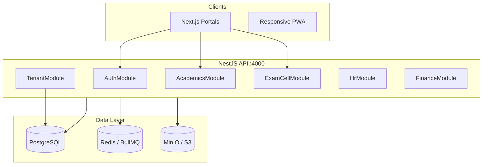
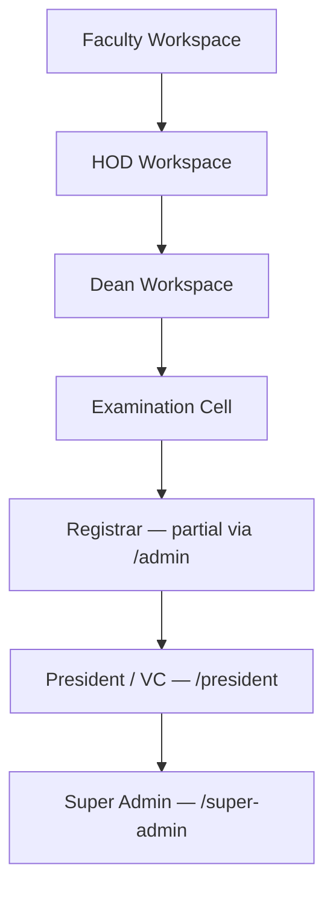
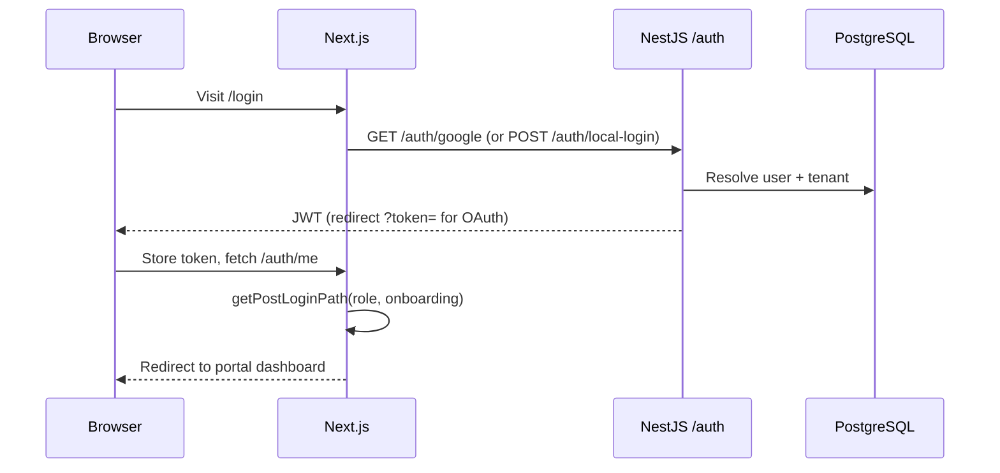
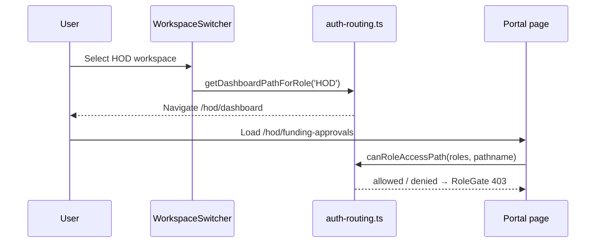
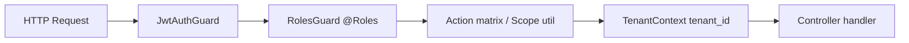
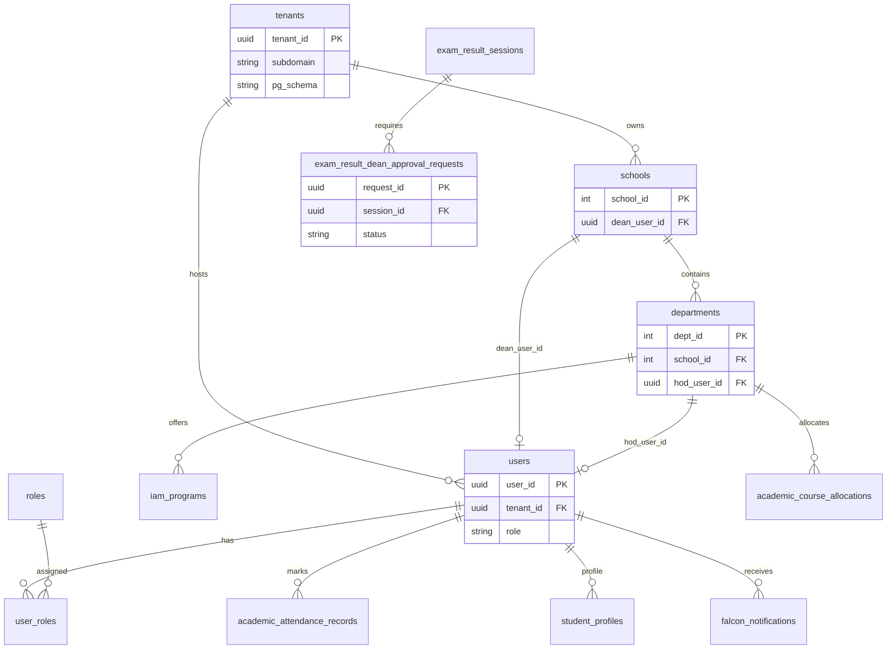
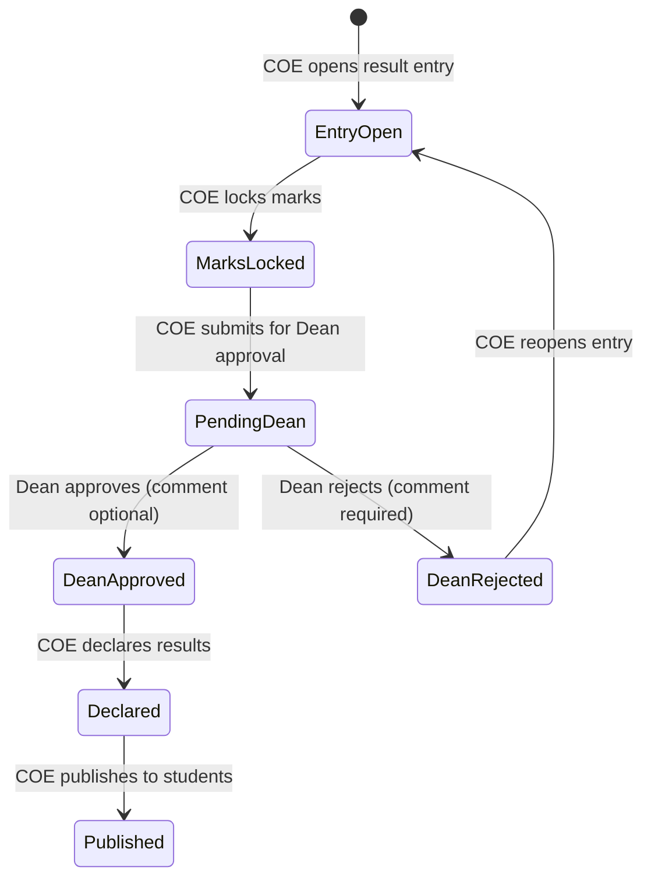

# Falcon SGVU Campus OS — Architecture

> **Related:** [SYSTEM_MAP.md](./SYSTEM_MAP.md) · [API_REFERENCE.md](./API_REFERENCE.md) · [SECURITY_GUIDE.md](./SECURITY_GUIDE.md)

Falcon is a multi-tenant university operating system for **Suresh Gyan Vihar University (SGVU)**. It unifies academic operations, examinations, HR, finance, hostel, placements, and governance into role-specific **portals** backed by a shared NestJS API and PostgreSQL database.

---

## 1. System overview



### Workspace hierarchy (academic governance)

The **Mechanical Engineering pilot** and broader rollout follow this escalation chain. Each level inherits visibility of lower tiers within its scope but cannot mutate data outside assigned boundaries.



| Level | Portal prefix | Primary roles | Scope | Key responsibilities |
|-------|---------------|---------------|-------|----------------------|
| 1 | `/faculty` | Faculty | Assigned courses, mentees | Attendance, assignments, grading, research funding requests, proxy lectures |
| 2 | `/hod` | HOD | Single department | Course allocation, teaching matrix, dept approvals (leave, proxy, extra class), funding first gate, compiled results |
| 3 | `/dean` | Dean | School (multiple departments) | Cross-dept analytics, escalated funding, grievances, **result declaration approvals**, school inbox |
| 4 | `/exam-cell` | ExamCell, DeputyCOE, ExamAdmin, ExamOperator | University examinations | Sessions, schedules, seating, admit cards, result control, declare/publish, UFM, grade cards |
| 5 | `/admin`, `/admin-ops` | Registrar, AdmissionsOfficer *(future full module)* | Campus records | IAM, admissions pipeline, verifications, master calendar *(partial today)* |
| 6 | `/president`, `/leadership` | President, Chairman | Executive oversight | Finance summary, compliance, convocation *(President portal live)* |
| 7 | `/super-admin` | SuperAdmin, CampusAdmin | Multi-entity SaaS | Tenant entities, hierarchy, impersonation (read-only guard) |

Deans use a **dedicated portal** at `/dean` (not the HOD shell). Multi-hat users switch via `WorkspaceSwitcher` (`frontend/src/components/layout/WorkspaceSwitcher.tsx`).

Post-login routing is centralized in `getPostLoginPath()` and `getDashboardPathForRole()` in `frontend/src/lib/auth-routing.ts`.

---

## 2. Repository structure

```
Falcon/
├── backend/                 # NestJS API (port 4000)
│   ├── src/
│   │   ├── auth/            # JWT, Google OAuth, local login
│   │   ├── common/          # Guards, interceptors, pagination, RBAC utils
│   │   ├── core/            # Audit, notifications, workflow, Redis, id-generator
│   │   ├── entities/        # TypeORM entity definitions
│   │   ├── modules/         # Feature modules (33+)
│   │   └── tenant/          # Multi-tenant context & schema routing
│   ├── migrations/          # SQL migrations (source of truth for schema)
│   └── scripts/             # Migration runners, dept seeds, demo generators
├── frontend/                # Next.js  App Router
│   └── src/
│       ├── app/(portals)/   # Role-gated portal routes (27 shells)
│       ├── components/      # Shared UI, portal shells, domain widgets
│       └── lib/             # navigation.ts, auth-routing.ts, API clients
├── tests/                   # Unified Jest + Playwright suite
└── docs/                    # This documentation set
```

### Backend modules (registered in `app.module.ts`)

Core academic & governance modules relevant to the pilot:

| Module | Route prefix | Purpose |
|--------|--------------|---------|
| `AuthModule` | `/auth`, `/api/auth` | Login, profile, permissions |
| `AcademicsModule` | `/api/academics` | Faculty, HOD, Dean academic ops |
| `ExamCellModule` | `/api/exam-cell` | Full examination lifecycle |
| `HrModule` | `/hr`, `/api/hr` | HRIS, ESS, payroll |
| `IamModule` | `/iam` | Schools, programs, hierarchy |
| `TenantModule` | — | Subdomain → tenant resolution |
| `AuditModule` | — | System & domain audit logs |

See [SYSTEM_MAP.md §9](./SYSTEM_MAP.md#9-backend-module--role-reference) for the full 45-module map.

---

## 2a. Frontend architecture

### Folder structure

```
frontend/src/
├── app/
│   ├── layout.tsx              # Root: TenantProvider, AuthProvider, SWRProvider
│   ├── middleware.ts           # Tenant subdomain cookie + x-tenant-subdomain header
│   ├── (auth)/login/           # Login shell
│   ├── auth/callback/          # OAuth JWT handoff
│   └── (portals)/              # 33 role workspaces (525 page.tsx files)
│       ├── faculty/
│       ├── hod/
│       ├── dean/
│       ├── exam-cell/
│       └── …                   # hr, finance, student, super-admin, etc.
├── components/
│   ├── layout/                 # RoleGate, AppShell, shells, search, notifications
│   ├── dean/, hod/, exam-cell/ # Domain widgets
│   └── ui/                     # PaginationBar, buttons, dialogs
├── context/                    # AuthContext, TenantContext, HrEntityContext
├── hooks/                      # useAuthedSWR, useNotifications, useDeanDepartments
└── lib/
    ├── navigation.ts           # PortalConfig per workspace
    ├── auth-routing.ts         # canRoleAccessPath, portalRoles
    ├── api/                    # Domain REST clients (no src/services/)
    └── exam-cell-rbac.ts       # Client-side action matrix mirror
```

### Routing

Next.js **App Router**. Portal URLs omit the `(portals)` segment — e.g. `/hod/funding-approvals` maps to `app/(portals)/hod/funding-approvals/page.tsx`.

Most portals wrap pages in:

```
RoleGate → PortalOnboardingGuard? → PortalShell → page
```

Layouts live at `app/(portals)/<portal>/layout.tsx` (36 layout files).

### Layouts & shells

| Shell | File | Portals |
|-------|------|---------|
| `FacultyShell` | `components/layout/FacultyShell.tsx` | faculty |
| `HodShell` | `components/layout/HodShell.tsx` | hod |
| `GenericPortalShell` | `components/layout/GenericPortalShell.tsx` | dean, exam-cell, many others |
| `AppShell` | `components/layout/AppShell.tsx` | Shared sidebar + top bar |

Navigation items come from `lib/navigation.ts` exports (`facultyPortal`, `hodPortal`, `deanPortal`, `examCellPortal`, …).

### State management

| Concern | Mechanism |
|---------|-----------|
| Auth session | `AuthContext` + `localStorage` token |
| Tenant branding | `TenantContext` |
| Server data | **SWR** via `useAuthedSWR`, `SWRProvider` |
| HR multi-entity | `HrEntityContext` + `useHrSWR` |
| Local UI | Component `useState` |

No Redux/Zustand in production code (`lib/store/index.ts` is a placeholder).

### Authentication (frontend)

- `AuthContext` (`context/AuthContext.tsx`) — login, logout, profile refresh
- `RoleGate` (`components/layout/RoleGate.tsx`) — blocks unauthorized portal paths; redirects to role dashboard
- `canRoleAccessPath()` — path-level RBAC before render
- API calls via `useAuthedApi()` (`lib/api.ts`) — attaches Bearer token; 401 redirects to login

### Workspace switching

`getAvailableWorkspaces()` (`lib/available-workspaces.ts`) builds switcher menu from `user.roles[]`. `WorkspaceSwitcher` in `AppTopBar` navigates to `getDashboardPathForRole()`.

---

## 2b. Backend architecture

### Module layout

```
backend/src/
├── auth/                   # JWT, Google OAuth, local login
├── tenant/                 # Subdomain resolution, schema routing
├── common/
│   ├── guards/             # JwtAuthGuard, RolesGuard, EntityScopeGuard, …
│   ├── decorators/         # @Roles, @Public, @HrPermission
│   ├── interceptors/       # Tenant, HR entity scope
│   └── utils/pagination.ts
├── core/                   # audit, notifications, workflow, redis
├── entities/               # 94 TypeORM entities (shared)
└── modules/                # 45 feature modules
    ├── academics/          # Faculty, HOD, Dean routes (184+ in controller)
    ├── exam-cell/          # Examination lifecycle (113 routes)
    ├── hr/, finance/, …
```

Modules register in `app.module.ts`. Each feature module typically contains:

- `*.module.ts` — Nest module definition
- `*.controller.ts` — HTTP routes with `@Controller('api/...')`
- `*.service.ts` — Business logic, scope checks, SQL
- `dto/` — class-validator request bodies
- `*.util.ts` — RBAC / scope helpers (e.g. `dean-scope.util.ts`)

### Controllers & guards

Protected routes use:

```typescript
@UseGuards(JwtAuthGuard, RolesGuard)
@Roles('HOD', 'SuperAdmin')
```

Global guards/interceptors (`app.module.ts`):

| Registration | Component |
|--------------|-----------|
| `APP_GUARD` | `ImpersonationReadOnlyGuard` |
| `APP_INTERCEPTOR` | `TenantContextInterceptor`, `TenantSchemaInterceptor`, `HrEntityScopeInterceptor` |

JWT is **not** global — each controller opts in. Public routes use `@Public()` (auth, tenant resolve).

### Validation

Global `ValidationPipe` in `main.ts`: `whitelist`, `forbidNonWhitelisted`, `transform`. DTOs use `class-validator` decorators.

### Database layer

- **PostgreSQL 16** with schema-per-tenant (`TenantSchemaInterceptor` sets `search_path`)
- Row-level `tenant_id` on entities extending `BaseTenantEntity`
- **229 SQL migrations** in `backend/migrations/` — source of truth (not `synchronize` in prod)
- TypeORM entities for ORM access; complex reporting uses raw SQL in services

---

### Frontend portal shells

Portals live under `frontend/src/app/(portals)/`. Each portal has:

- A **layout** with `RoleGate` middleware
- **Navigation** from `frontend/src/lib/navigation.ts` (`PortalConfig`)
- **Access rules** from `frontend/src/lib/auth-routing.ts` (`portalRoles`, `canRoleAccessPath`)

Key pilot portals:

| Prefix | Config export | Home route |
|--------|---------------|------------|
| `/faculty` | `facultyPortal` | `/faculty/dashboard` |
| `/hod` | `hodPortal` | `/hod/dashboard` |
| `/dean` | `deanPortal` | `/dean/dashboard` |
| `/exam-cell` | `examCellPortal` | `/exam-cell/dashboard` |

---

## 3. Authentication flow



### JWT payload (typical)

- `user_id`, `tenant_id`
- `role` (primary), `roles[]`, `primaryRole`
- `hr_capabilities`, `permissions[]` (HR module gating)
- `is_department_hod`, `onboarding_status` (routing hints)

### Permission resolution

1. **Login** — `LocalAuthProvider` or Google OAuth validates credentials against tenant schema.
2. **Role sync** — `user_roles` joined to `roles`; primary role from `users.role` or `primaryRole`.
3. **HR capabilities** — `/auth/me/permissions` returns module-level HR access for ESS routes.
4. **Controller check** — `RolesGuard` intersects JWT roles with `@Roles()` on handler.
5. **Action check** — Exam Cell calls `assertExamCellAction()`; Dean services call `resolveDeanScope()`.

### Workspace resolution



### Multi-role workspace switcher

When `user.roles.length > 1`, the header **WorkspaceSwitcher** lets users jump between portals via `getDashboardPathForRole()`. The active workspace role is derived from the URL path via `getActiveWorkspaceRoleFromPath()`.

### Portal access enforcement

1. **Frontend:** `canRoleAccessPath()` in middleware / `RoleGate`
2. **Backend:** `@UseGuards(JwtAuthGuard, RolesGuard)` + `@Roles(...)` per controller method
3. **Feature-specific:** Exam Cell action matrix (`exam-cell-rbac.util.ts`), Dean department scope (`dean-scope.util.ts`), HR entity scope (`EntityScopeGuard`)

---

## 4. RBAC architecture



### Portal permission matrix (pilot)

From `frontend/src/lib/auth-routing.ts` and `tests/helpers/rbac-matrix.ts`:

| Portal path | Allowed role keys |
|-------------|-------------------|
| `/faculty` | faculty |
| `/hod` | hod |
| `/dean` | dean |
| `/exam-cell` | examcell, deputycoe, examadmin, examoperator, superadmin |

SuperAdmin bypasses portal restrictions for support. Cross-portal denials are regression-tested in `tests/unit/regression/rbac-regression.spec.ts`.

### RBAC layers

| Layer | Mechanism | Example |
|-------|-----------|---------|
| Portal access | `portalRoles` map | `/exam-cell` → ExamCell, DeputyCOE, ExamAdmin, ExamOperator, SuperAdmin |
| Controller roles | `@Roles()` decorator | HOD-only: `@Roles('HOD', 'SuperAdmin')` |
| Action matrix | `assertExamCellAction()` | ExamOperator cannot `publish_results` |
| Dean scope | `resolveDeanScope()` | Dean sees only departments in their school |
| HOD scope | `dept_id` / `hod_user_id` | HOD funding approvals scoped to department |
| HR permissions | `@HrPermission()` + capabilities | Faculty sees only permitted HR modules |
| Tenant isolation | `TenantContextInterceptor` | All queries scoped by `tenant_id` |
| Impersonation | `ImpersonationReadOnlyGuard` | Writes blocked during SuperAdmin impersonation |

### Exam Cell role matrix

Defined in `backend/src/modules/exam-cell/exam-cell-rbac.util.ts` (mirrors frontend):

| Role | Dashboard | Sessions | Schedules | Admit cards | Seating | Publish results | UFM | Question papers |
|------|-----------|----------|-----------|-------------|---------|-----------------|-----|-----------------|
| ExamCell | ✓ | ✓ | ✓ | ✓ | ✓ | ✓ | ✓ | ✓ |
| DeputyCOE | ✓ | ✓ | ✓ | ✓ | ✓ | ✓ | ✓ | — |
| ExamAdmin | ✓ | ✓ | ✓ | ✓ | ✓ | — | — | — |
| ExamOperator | ✓ | — | — | ✓ | ✓ | — | — | — |

Action keys: `view_dashboard`, `manage_sessions`, `manage_schedules`, `generate_admit_cards`, `manage_seating`, `publish_results`, `approve_ufm`, `manage_qp`.

---

## 5. Database architecture

Falcon uses **PostgreSQL** with TypeORM entities in `backend/src/entities/` (94 `@Entity` tables). Schema changes go through **SQL migrations** in `backend/migrations/` (`npm run db:migrate`).

### Pilot ER diagram (IAM + academic core)



### IAM & hierarchy

| Table | Purpose |
|-------|---------|
| `tenants` | Multi-tenant root |
| `schools` | Academic schools; `dean_user_id` |
| `departments` | Departments; `hod_user_id`, `school_id` |
| `iam_programs` | Programs linked to school + department |
| `users`, `user_roles` | Accounts and multi-role assignments |
| `roles` | Role catalog (Faculty, HOD, Dean, ExamCell, …) |

### Academic operations

| Table | Purpose |
|-------|---------|
| `courses`, `course_offerings` | Subject catalog & semester offerings |
| `timetable_slots` | Scheduled classes |
| `attendance_records` | Session attendance |
| `faculty_course_allocations` | HOD teaching matrix |
| `project_funding_requests` | Research funding (HOD → Dean chain) |

### Examination

| Table | Purpose |
|-------|---------|
| `exam_sessions`, `exam_schedules` | Exam cycles & timetables |
| `exam_result_sessions` | Result control pipeline |
| `exam_result_dean_approval_requests` | Dean approval before declare |
| `exam_result_dean_approval_history` | Audit trail for decisions |
| `exam_seating_plans`, `exam_admit_cards` | Seating & hall tickets |
| `exam_ufm_cases` | Unfair means malpractice |
| `grade_cards` | Published grade cards / PDF export |

### Audit

| Table | Purpose |
|-------|---------|
| `system_audit_logs` | Auto-captured entity changes (TypeORM subscriber) |
| `audit_logs` | Domain-specific audit (Exam Cell actions) |

---

## 6. API architecture

### REST conventions

- Resource-oriented paths under `/api/<module>/`
- Nouns for collections (`GET /sessions`), verbs for actions (`POST .../dean-approval`)
- Dual auth prefixes: `/auth/*` and `/api/auth/*` (legacy compatibility)
- Idempotent reads; mutations return entity or `{ message }` on success

### Security on every request

| Header / mechanism | Purpose |
|--------------------|---------|
| `Authorization: Bearer <JWT>` | User identity |
| `x-tenant-subdomain` | Tenant resolution (also from Host cookie via Next middleware) |
| `x-entity-id` | HR multi-entity scope (HR module only) |

### Versioning

API is **unversioned** (no `/v1/` prefix). Breaking changes require coordinated frontend + migration releases.

### Filtering, sorting, search

Parsed by `parseListQuery()` in `backend/src/common/utils/pagination.ts`:

| Param | Behavior |
|-------|----------|
| `page`, `limit` | Page-based paging (default limit 20, max 100) |
| `offset`, `limit` | Offset-based alternative |
| `search` | Service-specific ILIKE / token match |
| `sort`, `order` | Column sort (`asc` / `desc`) |
| `status` | Workflow status filter where supported |

### Error handling

NestJS `HttpException` hierarchy. Global pipe rejects unknown DTO fields (`forbidNonWhitelisted`). No global exception filter — errors return standard JSON:

```json
{ "statusCode": 403, "message": "Forbidden" }
```

---

## 7. API conventions (quick reference)

### Base URLs

| Environment | API base |
|-------------|----------|
| Local | `http://localhost:4000` |
| Production | Tenant subdomain + reverse proxy |

Most feature routes use the `/api/` prefix (e.g. `/api/academics`, `/api/exam-cell`). Auth is available at both `/auth/*` and `/api/auth/*`.

### Authentication header

```
Authorization: Bearer <JWT>
```

Tenant resolution uses subdomain (`x-tenant-subdomain` or host-based) via `TenantContextInterceptor`.

### Pagination

List endpoints accept:

```
?page=1&limit=20
?offset=0&limit=20
?search=keyword&sort=created_at&order=desc
```

Response shape (`PaginatedResponse<T>`):

```json
{
  "data": [],
  "total": 142,
  "limit": 20,
  "offset": 0
}
```

Defaults: `limit=20`, max `100` (`backend/src/common/utils/pagination.ts`).

### Error contract

| Code | Meaning |
|------|---------|
| 401 | Missing or invalid JWT |
| 403 | Role or action denied (RBAC / scope) |
| 404 | Resource not found or outside scope |
| 422 | Validation error (class-validator DTOs) |

---

## 8. Shared components

Documented components that exist in the codebase (no placeholder names):

| Component | Path | Purpose |
|-----------|------|---------|
| **RoleGate** | `components/layout/RoleGate.tsx` | Client-side portal RBAC; 403 + redirect |
| **WorkspaceSwitcher** | `components/layout/WorkspaceSwitcher.tsx` | Multi-role hat switching |
| **PaginationBar** | `components/ui/PaginationBar.tsx` | Standard list paging UI |
| **UniversalSearchOmnibar** | `components/layout/UniversalSearchOmnibar.tsx` | Header global search |
| **SpotlightSearch** | `components/layout/SpotlightSearch.tsx` | People / nav search |
| **CommandMenu** | `components/layout/CommandMenu.tsx` | ⌘K command palette |
| **LiveNotificationBell** | `components/layout/LiveNotificationBell.tsx` | SWR-backed notification dropdown |
| **NotificationItem** | `components/notifications/NotificationItem.tsx` | Single notification row |
| **DeanApprovalTimeline** | `components/dean/DeanApprovalTimeline.tsx` | Funding/approval history (uses API `approval-timeline/:type/:id`) |
| **DeanFilterBar** | `components/dean/DeanFilterBar.tsx` | Dept/year/semester/date filters |
| **PublishConfirmDialog** | `components/exam-cell/PublishConfirmDialog.tsx` | Typed confirm for result publish |
| **ExamCellEmptyState** | `components/exam-cell/ExamCellEmptyState.tsx` | Empty lists + dev bootstrap |
| **AppShell / GenericPortalShell** | `components/layout/` | Sidebar + top bar chrome |

There is no standalone `SearchBar`, `NotificationCenter`, or `AuditTimeline` component — search uses the omnibar/spotlight pattern; audit uses paginated pages (`/exam-cell/audit-log`, `/dean/audit-log`).

Navigation is centralized in `frontend/src/lib/navigation.ts`. Each portal exports a `PortalConfig` with `navGroups`, `commandItems`, and optional role filters via `filterPortalConfigForRole()`.

---

## 9. Cross-cutting services

### Notifications

Feature modules emit events → `NotificationEmitterService` → in-app (`falcon_notifications`) + BullMQ email/WhatsApp delivery. See [SYSTEM_MAP.md §7](./SYSTEM_MAP.md#7-notification-event-bus).

### Workflow engine

HR and approval chains use `WorkflowModule` with configurable steps (`hr_approval_workflows`). Exam result declaration uses a dedicated Dean approval workflow backed by `exam_result_dean_approval_requests`.

### Background jobs (BullMQ)

Redis-backed queues for payroll, document export, fee demands, lead scoring, notification delivery, and AI submission processing. Requires `REDIS_HOST` in production.

---

## 10. Dean result approval flow (hardened)



Migration: `20260717100000_exam_result_dean_approval_requests.sql`

API:
- COE: `POST /api/exam-cell/result-control/sessions/:sessionId/dean-approval`
- Dean: `GET /api/academics/dean/intelligence/result-approvals`
- Dean: `POST /api/academics/dean/intelligence/result-approvals/:requestId/decision`

---

## 11. Source-of-truth files

| Concern | File |
|---------|------|
| Portal navigation | `frontend/src/lib/navigation.ts` |
| Role routing & access | `frontend/src/lib/auth-routing.ts` |
| Exam Cell RBAC | `backend/src/modules/exam-cell/exam-cell-rbac.util.ts` |
| Dean scope | `backend/src/modules/academics/dean-scope.util.ts` |
| Module registration | `backend/src/app.module.ts` |
| System map | `docs/SYSTEM_MAP.md` |

---

*Last updated: July 2026 — Phase C enterprise documentation; aligned with Mechanical Engineering pilot.*
