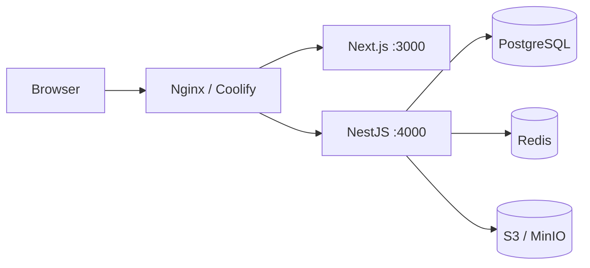
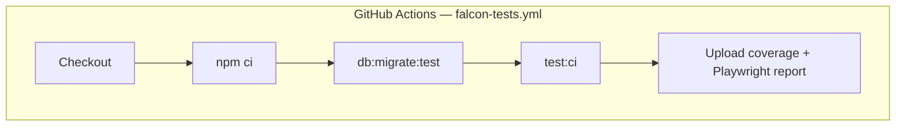

# Falcon Campus OS — Deployment Guide

Production deployment steps for SGVU Campus OS, with emphasis on the **Mechanical Engineering pilot** (HOD, Dean, Exam Cell).

---

## Pre-deploy checklist

Complete [MECHANICAL_PILOT_LAUNCH_CHECKLIST.md](./MECHANICAL_PILOT_LAUNCH_CHECKLIST.md) before enabling pilot users.

**Do NOT launch if:**

- Migrations not applied on production database
- Only local `npm run dev` is running (no hosted backend/frontend)
- HOD/Dean users not assigned to correct dept/school scope
- Dean result approval migration missing
- RBAC 403 smoke tests fail

---

## Architecture (typical production)



Single VPS (Coolify) or split: app server + managed PostgreSQL.

### Docker (local infrastructure)

`docker-compose.yml` at repository root:

| Service | Port | Purpose |
|---------|------|---------|
| postgres | 5433→5432 | `university_governance` |
| redis | 6379 | BullMQ |
| minio | 9000/9001 | S3-compatible uploads |
| prometheus | 9090 | Metrics scrape |
| grafana | 3001→3000 | Dashboards |

```bash
docker compose up -d    # from Falcon/
```

Backend and frontend run on the **host** during local dev (not containerized in compose).

### Docker (production images)

| Image | Dockerfile | Port | Coolify base dir |
|-------|------------|------|------------------|
| API | `backend/Dockerfile` | 4000 | `backend/` |
| Web | `frontend/Dockerfile` | 3000 | `frontend/` |

Backend image: multi-stage Node 20 Alpine, includes `migrations/` and `scripts/`.

Frontend image: Next.js standalone output; build args for `NEXT_PUBLIC_API_URL`, tenant subdomain, Google client ID.

---

## 1. Database

### Run migrations

```bash
cd backend
cp .env.example .env
# Configure production DATABASE_URL / DB_* 

npm run db:migrate
```

### Critical migrations (pilot)

| File | Required for |
|------|--------------|
| `20260717100000_exam_result_dean_approval_requests.sql` | Dean result approval workflow |
| `20260710120000_dean_school_scope_mapping.sql` | Dean school scope |
| `20260713140000_me_timetable_workload_seed.sql` | ME timetable & enrollments |
| `20260614130000_enterprise_performance_phase1.sql` | Performance indexes |

Verify:

```sql
SELECT EXISTS (
  SELECT FROM information_schema.tables
  WHERE table_name = 'exam_result_dean_approval_requests'
);
```

### Connection pooling

Production `.env`:

```env
DB_POOL_MAX=20
DB_POOL_MIN=2
DB_POOL_IDLE_MS=30000
DB_SYNCHRONIZE=false
TYPEORM_LOGGING=false
```

For 500+ concurrent users, add PgBouncer — see [PERFORMANCE.md](./PERFORMANCE.md).

---

## 2. Backend deploy

```bash
cd backend
npm ci
npm run build
npm run start:prod    # or PM2 / Docker CMD
```

### Required environment variables

| Variable | Notes |
|----------|-------|
| `NODE_ENV=production` | Disables dev login |
| `JWT_SECRET` | Strong random secret |
| `DB_*` or `DATABASE_URL` | Production PostgreSQL |
| `REDIS_HOST` | Required for BullMQ queues |
| `FRONTEND_URL` | Production frontend URL (OAuth redirect) |
| `DEFAULT_TENANT_SUBDOMAIN` | e.g. `sgvu` |
| `SAAS_BASE_DOMAIN` | Production domain |
| `GOOGLE_CLIENT_ID/SECRET` | Production OAuth credentials |
| `S3_*` | Production object storage |
| `EMAIL_*` | SMTP for notifications |

### Health check

```bash
curl -s -o /dev/null -w "%{http_code}" https://api.yourdomain.com/auth/me
# Expect 401 without token (proves server is up)
```

### Reverse proxy

- Route `/api/*` and `/auth/*` to backend :4000
- Enable GZIP (also enabled in Nest `main.ts`)
- WebSocket support if using live notifications

---

## 3. Frontend deploy

```bash
cd frontend
npm ci
npm run build
npm run start       # or static export + CDN
```

### Required configuration

- API base URL → production backend (not `localhost:4000`)
- Cookie domain aligned with SSO if using subdomain tenants
- All `(portals)` routes served: `/hod`, `/dean`, `/exam-cell`, `/faculty`

Verify build:

```bash
npm run build   # must exit 0
```

---

## 4. Redis & background workers

BullMQ queues require Redis for:

- Notification delivery
- HR payroll / document export
- Finance bulk demands
- Lead scoring

If Redis is down, synchronous paths may work but async jobs will fail silently — monitor queue depth in production.

---

## 5. Post-deploy smoke test (5 minutes)

Run with **production test accounts** (see checklist §4):

| Role | Test |
|------|------|
| HOD | Inbox, funding approval (ME scope only) |
| Dean | Inbox pagination, result approval approve/reject |
| ExamCell | Submit dean approval → declare after approve |
| ExamOperator | `POST /api/exam-cell/results/publish` → **403** |
| ExamAdmin | Declare result → **403** |

---

## 6. User & role provisioning

| Role | DB assignment |
|------|---------------|
| HOD | `departments.hod_user_id` for Mech Engg |
| Dean | `schools.dean_user_id` + dean_school_departments mapping |
| ExamCell | `user_roles` → ExamCell role |
| ExamAdmin | ExamAdmin role (limited actions) |
| ExamOperator | ExamOperator role (admit cards + seating only) |

Use `/admin/iam` (Registrar/SuperAdmin) or direct SQL in controlled migrations.

---

## 7. Monitoring (first 48 hours)

From [MECHANICAL_PILOT_LAUNCH_CHECKLIST.md](./MECHANICAL_PILOT_LAUNCH_CHECKLIST.md):

- [ ] Watch logs for 500s on `/api/academics/dean/*` and `/api/exam-cell/*`
- [ ] Dean notifications for pending result approvals
- [ ] Exam Cell audit log records declare/publish
- [ ] Gather HOD/Dean/COE feedback before full student rollout

### Log patterns to alert on

```
ForbiddenException.*publish_results
QueryFailedError.*exam_result_dean_approval
ECONNREFUSED.*redis
```

---

## 8. Rollback strategy

1. **Frontend:** redeploy previous build artifact
2. **Backend:** redeploy previous `dist/` — backward-compatible if no new required migrations
3. **Database:** migrations are forward-only; test rollback scripts separately. Do not drop approval tables if Dean workflow is live.

---

## 9. CI/CD pipeline



| Stage | Command | Failure impact |
|-------|---------|----------------|
| Typecheck | `tsc` + backend build + frontend `tsc` | Blocks merge |
| Lint | ESLint on tests + frontend test dirs | Blocks merge |
| Coverage | Jest + Vitest thresholds | Blocks merge |
| Build | `npm run build` both apps | Blocks merge |
| E2E | Playwright 55+ specs | Blocks merge |

Triggers: push/PR to `main`, `develop`.

---

## 10. CI gate before deploy

```bash
cd tests && npm run test:ci
```

GitHub Actions: `.github/workflows/falcon-tests.yml` on `main`/`develop`.

---

## Related documentation

| Doc | Purpose |
|-----|---------|
| [MECHANICAL_PILOT_LAUNCH_CHECKLIST.md](./MECHANICAL_PILOT_LAUNCH_CHECKLIST.md) | **Primary go-live checklist** |
| [DEVELOPER_GUIDE.md](./DEVELOPER_GUIDE.md) | Local setup & env vars |
| [SECURITY_GUIDE.md](./SECURITY_GUIDE.md) | RBAC verification |
| [PERFORMANCE.md](./PERFORMANCE.md) | Pooling & indexes |
| [TESTING_GUIDE.md](./TESTING_GUIDE.md) | Pre-deploy test commands (Phases A–B.1) |

---

## Sign-off template

| Role | Name | Date |
|------|------|------|
| IT / DevOps | | |
| COE / Exam Cell | | |
| Dean (Mech school) | | |
| HOD (Mechanical) | | |

---

*Deploy backend migrations before frontend when Dean result approval features are included in the release.*
