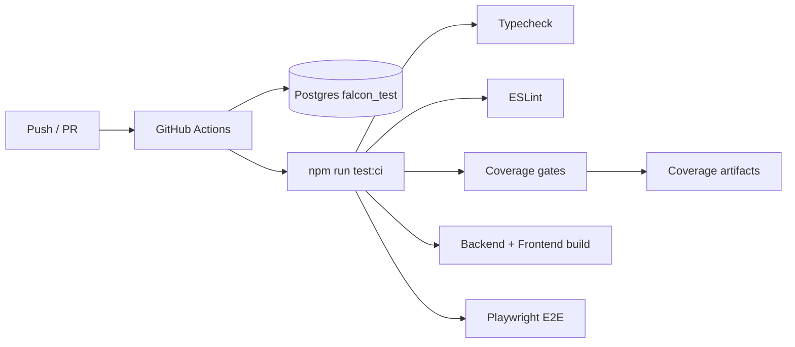

# Falcon Campus OS — Developer Guide

Practical setup and day-to-day development for the SGVU Campus OS monorepo.

---

## Prerequisites

| Tool | Version | Notes |
|------|---------|-------|
| Node.js | 20.x | Matches CI (`.github/workflows/falcon-tests.yml`) |
| PostgreSQL | 16.x | Default DB `university_governance` |
| Redis | 6+ | Required for BullMQ background jobs |
| MinIO (optional) | — | S3-compatible uploads; disk fallback available |

---

## Quick start (local)

```bash
# Clone and enter repo
cd Falcon

# Backend
cd backend
cp .env.example .env
npm install
npm run db:migrate
npm run start:dev          # builds TS → runs on :4000

# Frontend (new terminal)
cd frontend
npm install
npm run dev                # :3000
```

Open `http://localhost:3000`. API at `http://localhost:4000`.

### Dev login

When Google OAuth is not configured, use:

```bash
# GET (browser or curl)
http://localhost:4000/auth/dev-login/hod@mygyanvihar.com
```

Or `POST /auth/local-login` with email/password for seeded users.

---

## Environment variables

### Backend (`backend/.env`)

Copy from `backend/.env.example`. Critical variables:

| Variable | Purpose | Example |
|----------|---------|---------|
| `DB_HOST`, `DB_PORT`, `DB_USERNAME`, `DB_PASSWORD`, `DB_DATABASE` | PostgreSQL | `localhost:5433` |
| `JWT_SECRET` | Token signing | Change in production |
| `JWT_EXPIRATION` | Token TTL | `7d` |
| `DEFAULT_TENANT_SUBDOMAIN` | Default tenant | `sgvu` |
| `SAAS_BASE_DOMAIN` | Multi-tenant host | `localhost` |
| `FRONTEND_URL` | OAuth redirect target | `http://localhost:3000` |
| `GOOGLE_CLIENT_ID/SECRET` | Google SSO | From Google Cloud Console |
| `ALLOWED_DOMAIN` | Email domain filter | `mygyanvihar.com` |
| `REDIS_HOST`, `REDIS_PORT` | BullMQ | `127.0.0.1:6379` |
| `S3_*` | File uploads | MinIO defaults |
| `EMAIL_*` | Nodemailer | SMTP credentials |
| `GEMINI_API_KEY` | AI document validation | Optional locally |
| `DB_SYNCHRONIZE` | **Never `true` in prod** | Use migrations instead |
| `DB_POOL_MAX`, `DB_POOL_MIN` | Connection pool | See PERFORMANCE.md |

Set API URL via environment:

| Variable | Purpose | Default (local) |
|----------|---------|-----------------|
| `NEXT_PUBLIC_API_URL` | Client-side API base | `http://localhost:4000` |
| `API_URL` | Server-side; injected as `window.__FALCON_API_URL` | same |
| `NEXT_PUBLIC_DEFAULT_TENANT_SUBDOMAIN` | Tenant fallback | `sgvu` |
| `NEXT_PUBLIC_SAAS_BASE_DOMAIN` | Subdomain parsing | — |
| `NEXT_PUBLIC_EXAM_CELL_DEV_FALLBACK` | Exam Cell mock data | `'true'` in dev only |

Implementation: `frontend/src/lib/api-base-url.ts`, `frontend/src/middleware.ts`.

---

## Branch strategy

| Branch | Purpose |
|--------|---------|
| `main` | Production-ready releases |
| `develop` | Integration branch for features |
| Feature branches | `feature/<ticket>-short-description` from `develop` |

**Rules:**

- All merges to `main` / `develop` must pass `cd tests && npm run test:ci`
- Database migrations are forward-only — never edit applied migration files
- RBAC-sensitive changes require unit or integration test updates in `tests/`

---

## Coding standards

| Area | Convention |
|------|------------|
| Backend routes | `@Controller('api/<module>')` + `@Roles()` on every protected handler |
| Scope checks | Dean/HOD services must call `resolveDeanScope()` / dept filter before return |
| Exam Cell mutations | Call `assertExamCellAction()` before publish/declare/UFM |
| Frontend portals | Update `navigation.ts` + `auth-routing.ts` when adding routes |
| Migrations | `YYYYMMDDHHMMSS_description.sql` in `backend/migrations/` |
| Tests | Add to `tests/` unified suite; no duplicate smoke specs |
| Lint | ESLint 9 flat config; CI lints test infrastructure paths |

TypeScript strict mode enabled in backend and frontend. Backend builds with `tsc -p tsconfig.build.json` (not `nest build`).

---

## CI/CD



**Workflow:** `.github/workflows/falcon-tests.yml`

**Pre-merge / pre-deploy:**

```bash
cd tests && npm run test:ci
```

**Artifacts uploaded:** `coverage-unit`, `coverage-integration`, `coverage-frontend`, `playwright-report`

See [TESTING_GUIDE.md](./TESTING_GUIDE.md) for coverage thresholds and test layout.

---

## Database migrations

All schema changes are **SQL files** in `backend/migrations/`.

```bash
cd backend

# Apply pending migrations
npm run db:migrate

# Repair migration tracking (if needed)
npm run db:migrate:repair

# Optional seed pass
npm run db:seed
```

### Critical pilot migrations

| Migration | Purpose |
|-----------|---------|
| `20260717100000_exam_result_dean_approval_requests.sql` | Dean result approval tables |
| `20260713140000_me_timetable_workload_seed.sql` | Mechanical Engineering seed |
| `20260710120000_dean_school_scope_mapping.sql` | Dean ↔ school mapping |

### Department-specific seeds

Pre-built scripts for pilot departments:

```bash
# Verify ME seed applied
node scripts/verify-me-seed.js

# Generate new dept migration from timetable PDFs (Python)
python3 scripts/build-me-seed-data.py
python3 scripts/generate-me-migration.py
```

Similar pipelines exist for Civil, EE, Pharmacy, Physio (`build-*-seed-data.py`).

### Enterprise demo seed generator

Generate scalable demo SQL without touching CI databases:

```bash
cd backend
node scripts/generate-enterprise-demo-seed.js \
  --schools=2 --departments=6 --faculty=30 --students=500 \
  --output=scripts/output/demo-seed.sql
```

---

## Build commands

| Location | Command | Output |
|----------|---------|--------|
| `backend/` | `npm run build` | `dist/` (tsc) |
| `backend/` | `npm run start:prod` | Production server |
| `frontend/` | `npm run build` | `.next/` static export |
| `frontend/` | `npm run start` | Production Next server |

Backend uses `tsc -p tsconfig.build.json` (not `nest build`).

---

## Folder conventions

### Backend

```
backend/src/modules/<feature>/
  ├── <feature>.module.ts
  ├── <feature>.controller.ts   # HTTP routes
  ├── <feature>.service.ts      # Business logic
  ├── dto/                      # class-validator DTOs
  └── *.util.ts                 # RBAC / scope helpers
```

- **Controllers** use `@Controller('api/...')` for feature APIs.
- **Guards:** `JwtAuthGuard` + `RolesGuard` on protected routes.
- **Entities** live in `src/entities/` (shared across modules).
- **Cross-cutting:** `src/core/` (audit, notifications, workflow).

### Frontend

```
frontend/src/app/(portals)/<portal>/<route>/page.tsx
frontend/src/components/<domain>/   # Reusable domain UI
frontend/src/lib/                     # navigation, auth-routing, API
```

- Portal layouts wrap pages with `RoleGate`.
- Navigation defined once in `lib/navigation.ts`.
- Role routing in `lib/auth-routing.ts` — update both when adding portals.

### Tests

```
tests/
  unit/           # Pure logic (RBAC, pagination, dean scope)
  integration/    # Module wiring, API contracts
  e2e/            # Playwright browser tests
```

Run from `tests/` — see [TESTING_GUIDE.md](./TESTING_GUIDE.md).

---

## Common development tasks

### Add a new API endpoint

1. Add method to `*.controller.ts` with `@Roles(...)`.
2. Implement in `*.service.ts` with tenant + scope checks.
3. Add DTO in `dto/` if accepting body/query.
4. Wire frontend API client + page.
5. Add integration test if security-sensitive.

### Add a portal nav item

1. Edit `frontend/src/lib/navigation.ts` (portal's `navGroups`).
2. Create page under `app/(portals)/<portal>/`.
3. Update `portalRoles` in `auth-routing.ts` if new portal prefix.

### Add a migration

1. Create `backend/migrations/YYYYMMDDHHMMSS_description.sql`.
2. Run `npm run db:migrate` locally.
3. Document in CHANGELOG and MECHANICAL_PILOT_LAUNCH_CHECKLIST if pilot-critical.

---

## Troubleshooting

### Backend won't start

| Symptom | Fix |
|---------|-----|
| `ECONNREFUSED` PostgreSQL | Check `DB_HOST`/`DB_PORT`; default example uses `5433` |
| Migration fails | Run `npm run db:migrate:repair`; inspect SQL error |
| Redis connection errors | Start Redis or disable Bull-dependent features locally |
| `JWT malformed` | Clear browser token; re-login via dev-login |

### Frontend 403 on portal routes

- Confirm user role in `/auth/me`.
- Check `canRoleAccessPath()` in `auth-routing.ts`.
- Verify `launch-modules.ts` hasn't hidden the route for pilot.

### Dean/HOD sees wrong department data

- Verify `schools.dean_user_id` and `departments.hod_user_id` in DB.
- Run dean scope migration: `20260710120000_dean_school_scope_mapping.sql`.
- Test: `cd tests && npm run test:unit -- dean-scope`.

### Exam Cell 403 on publish

- Expected for `ExamAdmin` / `ExamOperator`.
- Check role with `assertExamCellAction()` matrix.
- COE needs `ExamCell` or `DeputyCOE` role.

### CORS / cookie issues

- Align `FRONTEND_URL` with actual frontend origin.
- Production: configure reverse proxy cookie domain.

### Slow list endpoints

- See [PERFORMANCE.md](./PERFORMANCE.md) for pooling, indexes, Redis cache keys.

---

## Useful scripts

| Script | Purpose |
|--------|---------|
| `backend/scripts/run-migrations.js` | Migration runner |
| `backend/scripts/audit-db.js` | DB health audit |
| `backend/scripts/verify-me-seed.js` | ME pilot data verification |
| `backend/scripts/generate-enterprise-demo-seed.js` | Scalable demo SQL |

---

## Documentation index

| Doc | Topic |
|-----|-------|
| [ARCHITECTURE.md](./ARCHITECTURE.md) | System design |
| [API_REFERENCE.md](./API_REFERENCE.md) | REST endpoints |
| [TESTING_GUIDE.md](./TESTING_GUIDE.md) | Test suite (Phases A–B.1) |
| [SECURITY_GUIDE.md](./SECURITY_GUIDE.md) | RBAC & hardening |
| [DEPLOYMENT_GUIDE.md](./DEPLOYMENT_GUIDE.md) | Production deploy |
| [PROJECT_ROADMAP.md](./PROJECT_ROADMAP.md) | Future work |
| [DOCUMENTATION_COVERAGE_REPORT.md](./DOCUMENTATION_COVERAGE_REPORT.md) | Phase C audit |
| [SYSTEM_MAP.md](./SYSTEM_MAP.md) | Roles & workflows |

---

*For production go-live, follow [MECHANICAL_PILOT_LAUNCH_CHECKLIST.md](./MECHANICAL_PILOT_LAUNCH_CHECKLIST.md).*
