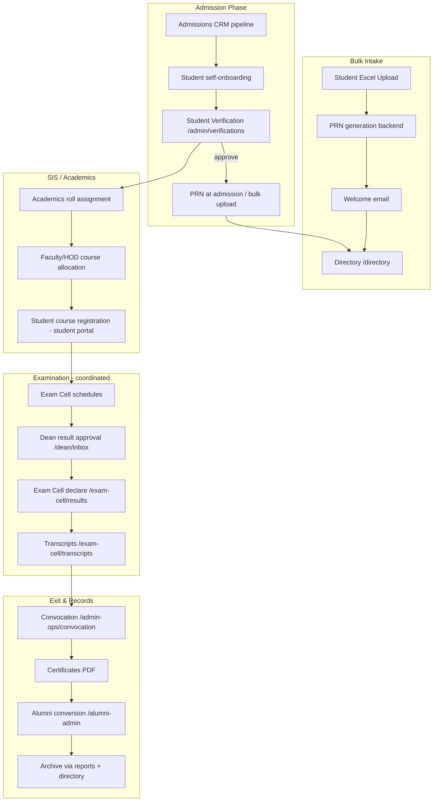

# Registrar Phase E.2 — User Journey Validation & Workflow Audit

**Audit date:** 2026-07-18  
**Auditor perspective:** University Registrar (first-time user)  
**Live URL:** https://falcon.jataka.io  
**Technical baseline:** Feature-complete (Phase E.1 score 96/100)  
**Journey baseline:** This audit

---

## Executive Summary

The Registrar **can complete core academic-year tasks** (verify students, bulk intake, roll numbers, directory, convocation, PhD queue) when they know where to go. However, a first-time Registrar will hit **navigation dead zones** because the product splits work across **two shells** (`/admin` and `/admin-ops`) without a visible bridge in the sidebar.

### Registrar Production Readiness Score (Journey): **89 / 100**

| Lens | Score | Note |
|------|-------|------|
| Core registrar duties (verify, bulk, rolls, directory) | 94 | Strong |
| End-to-end academic cycle connectivity | 82 | Gaps after exam phase |
| Navigation discoverability | 78 | Admin Ops hidden from Admin nav |
| Cross-module coordination | 90 | Exam panel helps; Exam Cell links may 403 |
| UX / learnability | 86 | Labels good; flow hints weak |
| **Overall journey readiness** | **89** | Pilot-ready with training; not self-evident |

**Verdict:** **Conditionally release-ready** — acceptable for trained Mechanical pilot Registrar; recommend navigation fixes before university-wide rollout.

---

# ✅ Deliverable 1 — Registrar Journey Report

## Day 0 — Login

| Step | Experience | Verdict |
|------|------------|---------|
| Receive credentials | Google SSO or local login (`@mygyanvihar.com`) | ✅ Clear |
| Land after login | `/admin/dashboard` — "Registrar Command Center" | ✅ Obvious |
| Understand scope | Two personas exist: **Falcon Admin Console** + **Registrar & Facilities** (`/admin-ops`) | ⚠️ Not explained at login |

## Typical morning

1. **Dashboard** — pending verifications count, governance tickets, profile corrections  
2. **Student Verifications** — approve/reject with document preview  
3. **Directory** — confirm student appears after approval  
4. **Academics** — assign semester roll numbers  

## Mid-year

5. **Governance Tasks** — monthly compliance uploads (IQAC-style tasks if assigned)  
6. **Upload History** — proof of submitted files  
7. **Admin Ops** — calendar, announcements, venue approvals (if discovered)  

## End of year

8. **Exam coordination** — via dashboard panel links (Dean approval → Exam Cell)  
9. **Convocation** — `/admin-ops/convocation` certificate batches  
10. **Alumni conversion** — `/alumni-admin/verification` (if discovered)  
11. **Reports** — warehouse CSV exports  

## Logout

Account settings at `/admin/account/settings` — ✅ reachable from shell.

---

# ✅ Deliverable 2 — Complete Workflow Map

## Master academic cycle (Registrar view)

### Connection status by step

| Step | Registrar entry | Next step obvious? | End-to-end path? |
|------|-----------------|--------------------|------------------|
| Admission CRM | RBAC yes; **nav no** | ❌ | ⚠️ Partial |
| Student verification | ✅ Sidebar | ⚠️ No "go to directory" CTA | ✅ |
| PRN generation | Bulk upload only | ⚠️ Not on Academics page | ✅ via bulk |
| Roll numbers | ✅ Academics | ⚠️ No link to exam phase | ✅ |
| Course registration | ❌ Not in Admin Console | N/A | ⚠️ Other portals |
| Examination | Dashboard exam panel | ⚠️ May 403 without COE role | ⚠️ Coordinate only |
| Dean approval | Link on dashboard | ✅ | ⚠️ Dean role required |
| Transcript | Exam Cell link | ⚠️ COE role required | ⚠️ |
| Degree / certificate | Convocation page | ⚠️ Hidden nav path | ✅ if URL known |
| Alumni | `/alumni-admin` | ❌ Not in Admin nav | ⚠️ |
| Archive | Reports + directory export | ⚠️ No "archive" module | ⚠️ Export only |

---

# ✅ Deliverable 3 — Navigation Audit

## Registrar-visible menus

### Falcon Admin Console (`/admin`) — **Primary**

| Menu item | Reachable | Purpose clear | Exit / next step |
|-----------|-----------|---------------|------------------|
| Dashboard | ✅ | ✅ | Links to verifications |
| Governance Tasks | ✅ | ⚠️ IQAC branding | Upload History |
| Upload History | ✅ | ✅ | Standalone |
| IAM & Hierarchy | ✅ | ⚠️ Read-only for Registrar | Dead end (view only) |
| Student Verifications | ✅ | ✅ | No post-approve wizard |
| Academics | ✅ | ✅ | Bulk upload card; exam panel |
| Student Excel Upload | ✅ | ✅ | Directory manual step |
| University Directory | ✅ | ✅ | Profile 360 |
| Ph.D. Admissions | ✅ | ✅ | Self-contained |

**Hidden from sidebar but RBAC-allowed:** Admissions CRM, Admin Ops, Reports, IQAC, Placements, Alumni Admin, Leadership, Documents, Clinic Admin.

### Registrar & Facilities (`/admin-ops`) — **Secondary shell**

| Item | Reachable from Admin nav? |
|------|---------------------------|
| Convocation & Certificates | ❌ **Not in Admin sidebar** |
| Master Timetable | ❌ |
| Calendar / Announcements | ❌ |
| Fleet / Assets | ❌ |

**Discovery paths today:**
1. Dashboard → Examination coordination panel → Convocation link ✅  
2. Direct URL `/admin-ops/*` ✅  
3. Sidebar ❌ missing bridge  

### Command palette (Admin shell)

| Item | Works |
|------|-------|
| Pending Approvals → `/admin/verifications` | ✅ |
| University Directory | ✅ |
| Export Reports → `/reports` | ✅ |
| Admissions Kanban | ❌ Hidden (AdmissionsOfficer only) |

### Dead ends / orphans

| Page | Issue |
|------|-------|
| `/admin/iam` (Registrar) | Read-only; no "contact Campus Admin" guidance |
| `/admin/admissions` | Redirects to CRM — Registrar has no nav to CRM |
| Exam Cell links (Registrar-only login) | **403** — expected but abrupt |
| `/admin/operations` | Hub page exists but **Registrar cannot see Operations menu item** |

### Breadcrumbs

❌ **Not present** — Registrar cannot see where they are in a multi-step cycle.

### Workspace switcher

Shows only when user has **multiple roles**. Single-role Registrar sees **no switcher** — cannot discover Admin Ops as a "second workspace."

---

# ✅ Deliverable 4 — Missing Workflow Report

| # | Missing / broken | Type |
|---|------------------|------|
| M1 | Post-verification wizard (approve → view in directory → assign roll) | Flow gap |
| M2 | Admin Ops in Admin sidebar (or unified shell) | Navigation |
| M3 | Admissions CRM link for Registrar in Admin nav | Navigation |
| M4 | Alumni conversion link at end-of-cycle | Navigation |
| M5 | PRN assignment visibility on Academics (copy says bulk/admission only) | Clarity |
| M6 | Course registration — no registrar oversight screen | Scope gap |
| M7 | Formal records archive module | Feature gap (export-only today) |
| M8 | In-app notification when Dean approves results (Registrar) | Notification |
| M9 | Audit log viewer for registrar actions in Admin Console | Audit |
| M10 | Breadcrumb / "You are here in the cycle" progress | UX |

**Broken links:** None in Registrar-visible nav (fixed: Upload History, inbox, reports redirects).

---

# ✅ Deliverable 5 — UX Audit

## Can a new Registrar learn without training?

| Question | Answer |
|----------|--------|
| Are labels clear? | **Mostly yes** — "Student Verifications", "Academics", "Convocation" |
| Are actions predictable? | **Yes** on core pages |
| Can tasks be done quickly? | **Yes** after learning two shells |
| Reduces admin work? | **Yes** — bulk upload, directory export, verification queue |
| First-day confusion? | **High** — Admin vs Admin Ops split |

## Friction points

1. **Two homes** — `/admin/dashboard` vs `/admin-ops/dashboard`  
2. **Governance Tasks** — feels like IQAC officer work, not Registrar  
3. **Exam links** — open COE screens; failure is technical (403), not explanatory  
4. **No "what's next"** after approve/reject verification  
5. **IAM read-only** — Registrar may think it's broken  

---

# ✅ Deliverable 6 — Issue Register

## Critical Issues

| ID | Problem | Impact | Recommended solution | Priority | Effort |
|----|---------|--------|----------------------|----------|--------|
| C1 | **Admin Ops not in Admin sidebar** — Convocation, timetable, calendar unreachable without training | Registrar cannot run degree/certificate cycle from primary shell | Add "Registrar Operations" nav group linking to `/admin-ops/convocation`, calendar, timetable | **P0** | 2–4 hrs |
| C2 | **No post-verification flow** — after approve, user must guess next step | Slow onboarding; errors in roll assignment timing | Add success panel: "View in Directory" + "Assign rolls when semester starts" | **P0** | 4–6 hrs |
| C3 | **Exam Cell deep links 403** for Registrar-only accounts | Broken expectation when clicking Transcripts/Results | Show tooltip: "Requires Examination Cell workspace"; hide or gate links by role | **P1** | 2–3 hrs |

## Medium Issues

| ID | Problem | Impact | Recommended solution | Priority | Effort |
|----|---------|--------|----------------------|----------|--------|
| M1 | Admissions CRM accessible but not in nav | Registrar cannot manage pipeline without URL | Add nav item or dashboard card → `/admissions-crm/pipeline` | P1 | 1–2 hrs |
| M2 | Alumni conversion not linked from convocation flow | End-of-cycle gap | Link convocation page → `/alumni-admin/verification` | P2 | 1 hr |
| M3 | Dual portal shells confuse persona | Cognitive load | Unified sidebar or "Facilities & Convocation" section in Admin | P1 | 4–8 hrs |
| M4 | No registrar audit trail UI | Compliance gap | Link to exam-cell audit or registrar action log | P2 | 1–2 days |
| M5 | IAM read-only without explanation | Support tickets | Banner: "View only — contact Campus Admin for HOD/Dean assignment" | P2 | 30 min |

## Low Priority Improvements

| ID | Problem | Impact | Recommended solution | Priority | Effort |
|----|---------|--------|----------------------|----------|--------|
| L1 | No breadcrumbs | Minor disorientation | Portal-level breadcrumb component | P3 | 1–2 days |
| L2 | Governance Tasks IQAC-centric copy | Label confusion | Rename for Registrar: "Compliance submissions" | P3 | 1 hr |
| L3 | Workspace label generic ("Registrar Workspace") | Polish | Explicit label in `getWorkspaceLabelForRole` | P3 | 15 min |
| L4 | No first-login checklist | Training burden | Optional dashboard checklist widget | P3 | 4–6 hrs |
| L5 | Archive is export-only | Long-term records | Document as process; future archive module Q4 | P4 | Epic |

---

# Step 6 — Cross-Module Validation

| Partner | Registrar role | Duplication? | Coordination path |
|---------|----------------|--------------|-------------------|
| **Faculty** | Profile corrections via helpdesk | ✅ No dup | Dashboard widget |
| **HOD** | None direct | ✅ | Directory view |
| **Dean** | Result approval (observe) | ✅ No dup | Dashboard link → `/dean/inbox` |
| **Exam Cell** | Transcripts, results, seating | ✅ No dup | Exam panel (COE executes) |
| **President** | Reports overlap | ⚠️ Minor | `/reports` shared |
| **Super Admin** | IAM writes, PRN rules | ✅ Correct split | Registrar read-only IAM |
| **Admissions Officer** | CRM pipeline | ⚠️ Overlap | Registrar can access CRM but nav hidden |

**Principle respected:** Registrar **coordinates** examination and convocation; does not duplicate COE publish or Dean approve actions.

---

# Step 7 — Scenario Walkthroughs

## Scenario A — Wrong documents

| Step | Path | Works? |
|------|------|--------|
| Student uploads wrong docs | Student portal | ✅ (external) |
| Registrar reviews | `/admin/verifications` | ✅ |
| Reject with remarks | Reject dialog + remarks required | ✅ |
| Student resubmits | Student onboarding | ✅ |
| Approve | Approve button | ✅ |
| **Gap:** notify student in-app | Email/backend | ⚠️ Assumed |

## Scenario B — Results to degree

| Step | Path | Works? |
|------|------|--------|
| Dean approves | `/dean/inbox` | ✅ (Dean role) |
| Exam publishes | `/exam-cell/results` | ✅ (COE role) |
| Registrar transcript | Exam panel link | ⚠️ 403 if Registrar-only |
| Degree / certificate | `/admin-ops/convocation` | ✅ if URL known |
| Student download | Certificate automation backend | ✅ |

## Scenario C — Bulk 2000 students

| Step | Path | Works? |
|------|------|--------|
| Download template | Bulk upload page | ✅ |
| Upload Excel | Drag-drop POST | ✅ |
| Validation errors | API error messages | ✅ |
| PRN generation | Backend (needs enrollment rule) | ⚠️ Super Admin prerequisite |
| Welcome email | Backend listener | ✅ |
| Directory update | Manual `/directory` | ⚠️ No auto-link |

---

# Menu-by-Menu Validation Matrix

| Page | Purpose | User | Search | Filter | Export | Approval | Audit | Next step |
|------|---------|------|--------|--------|--------|----------|-------|-----------|
| Dashboard | Command center | Registrar | — | — | — | Via widgets | Partial | Verifications |
| Verifications | Onboarding gate | Registrar | — | — | — | ✅ | Backend | **Missing CTA** |
| Academics | Roll numbers | Registrar | — | — | — | — | Backend | Bulk upload |
| Bulk upload | Mass intake | Registrar | — | — | Template | — | Backend | Directory |
| Directory | Roster | All staff | ✅ | ✅ | ✅ CSV | — | — | Profile 360 |
| Upload history | Compliance proof | Registrar | ✅ | ✅ | Download | — | — | Tasks |
| Governance tasks | Monthly tasks | IQAC/HR/Registrar | — | — | — | — | AI audit | Upload history |
| PhD queue | Doctoral awards | Registrar | — | — | — | ✅ | Backend | — |
| IAM | Hierarchy view | Registrar RO | — | — | — | — | — | Dead end |
| Convocation | Degrees/certs | Registrar | — | Queue filter | PDF | ✅ verify | Backend | **Hidden nav** |
| Reports | Data warehouse | Registrar | — | — | ✅ | — | — | — |

---

# Final Scores

| Deliverable | Status |
|-------------|--------|
| Registrar Journey Report | ✅ Complete |
| Complete Workflow Map | ✅ Complete |
| Navigation Audit | ✅ Complete |
| Missing Workflow Report | ✅ Complete |
| UX Audit | ✅ Complete |
| Critical / Medium / Low issues | ✅ 3 / 5 / 5 documented |

## Production Readiness

| Metric | Score |
|--------|-------|
| Technical (E.1) | 96 / 100 |
| **User journey (E.2)** | **89 / 100** |
| **Combined release recommendation** | **Pilot yes** — document Admin Ops path; fix C1–C2 before full rollout |

---

## Recommended immediate fixes (no UI redesign)

1. Add **"Facilities & Convocation"** items to `adminPortal` nav for Registrar (convocation, calendar, timetable).  
2. Add **post-verification success actions** on approve.  
3. **Role-gate** Exam Cell links with clear message for Registrar-only users.  

*No new pages required — navigation and CTAs only.*

---

*Audit performed against codebase + navigation config at commit on branch `release/v0.6.0` / local E.2 polish. Validate on `falcon.jataka.io` after deploy.*
