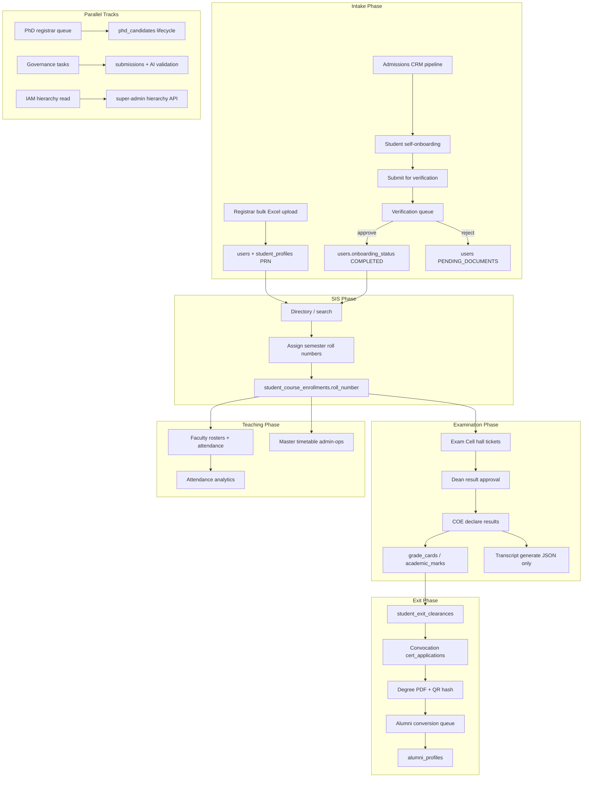
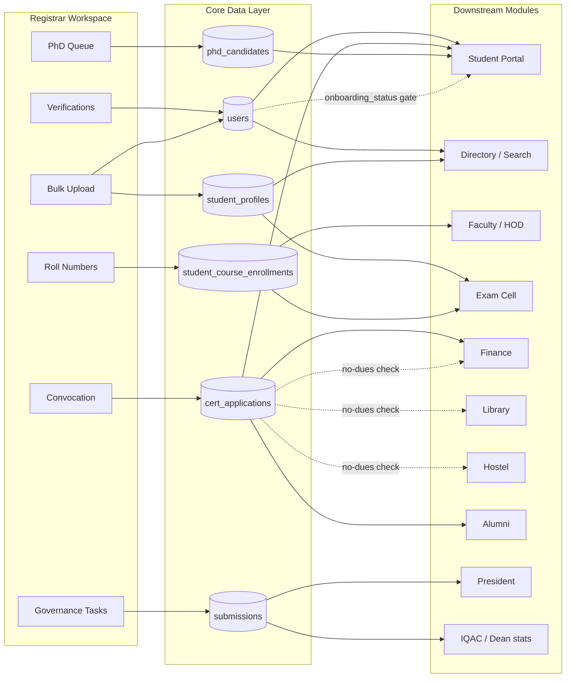
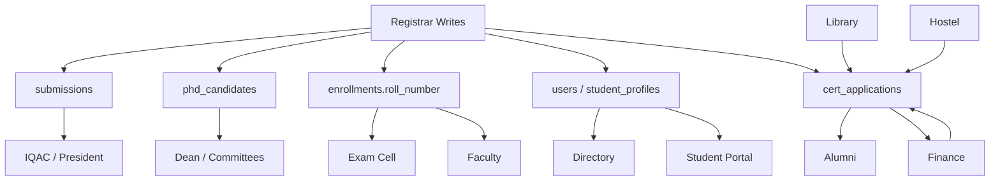

# Registrar Phase E.3 — Cross-Module Data Flow & Business Process Validation

**Audit date:** 2026-07-18  
**Scope:** Every Registrar action traced from creation → consumption → final destination  
**Method:** Backend service/controller trace + frontend API wiring + cross-module reader grep  
**Constraints:** No UI redesign, no new features, no business-logic changes — validation only  
**Live URL:** https://falcon.jataka.io  
**Prior baselines:** E.1 technical 96/100 · E.2 journey 89/100  

---

## Executive Summary

The Registrar workspace **writes real data** into core SIS tables (`users`, `student_profiles`, `student_course_enrollments`, `cert_applications`, `phd_candidates`, governance `submissions`). Downstream modules **Faculty, HOD, Exam Cell, Student Portal, Directory, Finance, Alumni** consume that data through established joins and APIs.

**Critical cross-module gaps** are not missing pages — they are **integration holes**:

1. **No audit trail** on any Registrar write action (verification, bulk, rolls, convocation verify, PhD actions).
2. **President convocation dashboard is stub data** — not wired to `cert_*` tables.
3. **Transcript generation is ephemeral** — no persisted record, no student download artifact, no reports dataset.
4. **Governance Upload History ≠ Bulk Upload History** — Registrar bulk intake is invisible in Upload History UI.
5. **Several flows lack terminal notifications** (verification reject, roll assignment, governance task assign).

### Production Readiness Scores (Phase E.3)

| Lens | Score | Note |
|------|-------|------|
| Core SIS data integrity (verify → PRN → directory → rolls) | **91** | Strong |
| Examination → convocation → alumni chain | **74** | Transcript gap; President stub |
| Notification completeness | **68** | Multiple silent transitions |
| Audit & compliance traceability | **52** | Registrar actions largely unaudited |
| Dashboard/report propagation | **71** | Reports warehouse missing cert/PhD/transcript |
| Cross-module reader coverage | **86** | Faculty/Exam/Directory well wired |
| **Overall data-flow readiness** | **78 / 100** | Pilot OK with manual reconciliation |
| **Combined (E.1 + E.2 + E.3)** | **84 / 100** | Conditionally production-ready |

**Verdict:** Registrar actions **do propagate** through the academic OS for core intake and exit workflows. **Not production-grade for compliance audit** until Registrar write actions emit audit rows and leadership dashboards read live convocation data.

---

# Deliverable 1 — Business Process Map

## Master lifecycle (Registrar as orchestrator)

---

## Registrar action inventory (all entry points)

| # | Action | UI entry | Primary API | Write tables |
|---|--------|----------|-------------|--------------|
| A1 | Approve student verification | `/admin/verifications` | `POST /api/admin/student-verifications/:id/approve` | `users`, `student_onboarding_docs`, `falcon_notifications` |
| A2 | Reject student verification | `/admin/verifications` | `POST .../reject` | Same + `admin_remarks` |
| A3 | Bulk student upload | `/admin/students/bulk-upload` | `POST /admissions/students/bulk-upload` | `users`, `user_roles`, `student_profiles`, `enrollment_id_counters` |
| A4 | Assign roll numbers | `/admin/academics` | `POST /api/academics/enrollments/assign-roll-numbers` | `student_course_enrollments.roll_number` |
| A5 | View/export directory | `/directory` | `GET /api/search/directory`, `.../export` | Read-only |
| A6 | Create convocation event | `/admin-ops/convocation` | `POST /api/certificate-automation/events` | `cert_events` |
| A7 | Verify degree application | `/admin-ops/convocation` | `POST .../applications/:id/verify` | `cert_applications` |
| A8 | Batch generate certificates | `/admin-ops/convocation` | `POST .../events/:id/generate-certificates` | `cert_applications.certificate_url`, object storage |
| A9 | PhD registrar action | `/admin/phd/admissions` | `POST /api/phd-lifecycle/candidates/:id/action` | `phd_candidates`, `phd_submissions`, `phd_committee_decisions` |
| A10 | Submit governance evidence | `/admin/tasks` | `POST /tasks/submissions/:assignmentId` | `submissions`, `task_assignments.status` |
| A11 | View upload history | `/admin/upload-history` | `GET /tasks/submissions/my` | Read-only |
| A12 | IAM hierarchy view | `/admin/iam` | `GET /api/super-admin/hierarchy/*` | Read-only (Registrar) |
| A13 | Export reports | `/reports` | `GET /api/reports/warehouse/:dataset` | Read-only CSV |
| A14 | Admissions CRM ops | `/admissions-crm/*` (RBAC, nav hidden) | `/api/admissions-crm/*` | Pipeline tables |
| A15 | Alumni verification | `/alumni-admin/*` (RBAC) | `/api/alumni-admin/*` | `alumni_profiles`, `student_exit_clearances` |
| A16 | Calendar/timetable/venue | `/admin-ops/*` | Multiple admin-ops APIs | Timetable/calendar/event tables |
| A17 | Dashboard observe | `/admin/dashboard` | Directory + verifications + leadership issues | Read-only |

---

# Deliverable 2 — Cross-Module Flow Diagram

---

# Deliverable 3 — Data Flow Report (Per Flow)

Format: **Start → Action → Database → API → Destination → Notification → Audit → Reports → End State**

---

## Flow 1 — Student Verification

| Stage | Detail |
|-------|--------|
| **Start** | Student completes onboarding → `POST /api/student/onboarding/submit` |
| **Action** | Registrar approves/rejects at `/admin/verifications` |
| **Database** | **Approve:** `users.onboarding_status='COMPLETED'`, `student_onboarding_docs.status='APPROVED'`, dismiss `falcon_notifications`. **Reject:** status `PENDING_DOCUMENTS`, docs `REJECTED` + remarks |
| **API** | `POST /api/admin/student-verifications/:targetUserId/approve\|reject` |
| **Destination modules** | **Student Portal** (portal gate lifted on COMPLETED), **Directory** (persona label), **Admissions CRM** (dossier reads approved docs), **Auth/JWT** (onboarding in token) |
| **Users notified** | **Submit:** CampusAdmin, AdmissionsOfficer, Registrar, SuperAdmin (+ HR for staff). **Approve:** welcome **email only** (no in-app). **Reject:** **nobody notified** |
| **Audit** | ❌ None (no `system_audit_logs`, no `exam_audit_logs`) |
| **Reports** | `admissions` warehouse export includes student once profile exists |
| **Dashboards** | Registrar dashboard queue count decreases; directory total unchanged (student existed pre-approval) |
| **End state** | Student can use full portal; appears in directory with active persona |

**Gap:** Reject path relies on student returning to onboarding UI — no push notification.

---

## Flow 2 — Bulk Upload → PRN → Directory

| Stage | Detail |
|-------|--------|
| **Start** | Registrar downloads template, uploads Excel |
| **Action** | `POST /admissions/students/bulk-upload?rule_id=` |
| **Database** | Per row: `enrollment_id_counters`++, `users` (PENDING_PASSWORD_RESET), `user_roles`, `student_profiles` (`prn_number`, `enrollment_no`, batch) |
| **API** | `/admissions/students/bulk-upload`, template GET |
| **Destination modules** | **Student onboarding** wizard, **Directory** (search on `enrollment_no`), **Exam Cell** (PRN fallback in hall tickets), **Faculty** (roll fallback), **Certificate PDF** (enrollment on degree) |
| **Users notified** | Each new student: `falcon_notifications` + **queued email** with temp password (`hr.onboarding_credentials`) |
| **Audit** | ❌ None; `actorUserId` passed but unused |
| **Reports** | `admissions` dataset picks up new rows on next export |
| **Dashboards** | Directory student count increases on refresh; **President/Dean dashboards do not show bulk-intake event** |
| **End state** | N students at password-reset onboarding; PRN permanent |

**Gap:** Upload History page reads governance `submissions`, **not** bulk upload runs — orphan visibility for mass intake.

---

## Flow 3 — Roll Number Allocation

| Stage | Detail |
|-------|--------|
| **Start** | Enrollments exist in `student_course_enrollments` (from course registration elsewhere) |
| **Action** | Registrar assigns rolls at `/admin/academics` |
| **Database** | `student_course_enrollments.roll_number` = 1…N per semester/course filter |
| **API** | `POST /api/academics/enrollments/assign-roll-numbers` |
| **Destination modules** | **Faculty workspaces** (`ROLL_NUMBER_SQL` prefers `e.roll_number`), **Exam Cell** (hall tickets, seating), **Attendance** (enrollment joins), **PhD lifecycle** (enrollment reads) |
| **Users notified** | ❌ None |
| **Audit** | ❌ None (other academics ops use `DeanAuditService`; this method does not) |
| **Reports** | `attendance_analytics` uses enrollments indirectly |
| **Dashboards** | No dashboard widget reflects roll assignment |
| **End state** | Semester rolls live for faculty/exam; PRN unchanged |

---

## Flow 4 — Directory & Student 360

| Stage | Detail |
|-------|--------|
| **Start** | Any upstream user/profile change |
| **Action** | Registrar searches/exports at `/directory` |
| **Database** | Read: `users`, `student_profiles`, `roles`, `departments`, joins for finance/UFM in 360 view |
| **API** | `GET /api/search/directory`, `GET .../export`, `GET .../profile/:id` |
| **Destination modules** | **President**, **Registrar**, **Campus Admin** — shared roster |
| **Users notified** | N/A (read path) |
| **Audit** | Export not logged |
| **Reports** | Manual CSV export parallel to warehouse |
| **Dashboards** | Registrar dashboard uses `directory?role=Student&limit=1` for total count |
| **End state** | Human-verified roster view; **not a write-back channel** |

---

## Flow 5 — Convocation (Eligibility → No Dues → Degree → Alumni)

| Stage | Detail |
|-------|--------|
| **Start** | Registrar creates event `/admin-ops/convocation` |
| **Action chain** | Event → student apply → finance pay → registrar verify → batch PDF |
| **Database** | `cert_events`, `cert_applications`, `finance_fee_demands`, `finance_transactions`, `student_exit_clearances`, PDF in object storage |
| **API** | `/api/certificate-automation/*` |
| **Destination modules** | **Student Portal** (`/student/certificates`, `applications/mine`), **Finance** (demand paid webhook), **Alumni conversion** (shared no-dues gate via `AlumniConversionService`) |
| **Users notified** | Event open → eligible students; payment → pending verification; verify/reject → student; batch done → admin (`/admin-ops/convocation`) |
| **Audit** | Status fields on `cert_applications` only; no centralized audit |
| **Reports** | ❌ No convocation dataset in warehouse |
| **Dashboards** | **President `GET /api/president/convocation` returns hardcoded stub** — not connected to `cert_*` |
| **End state** | PDF with SHA256 verification code embedded; DigiLocker push logged as stub |

**Gaps:** President sees fake convocation numbers; alumni conversion is **manual** via `/alumni-admin`, not auto-triggered post-certificate.

---

## Flow 6 — Transcript

| Stage | Detail |
|-------|--------|
| **Start** | Results published; UFM cases may block |
| **Action** | Exam Cell `POST /api/exam-cell/transcripts/generate` (Registrar links via exam panel — **403 if Registrar-only**) |
| **Database** | **Read only** — `student_course_enrollments`, `grade_cards`, `academic_marks`, `ufm_cases`; **no transcript table** |
| **API** | Generate returns in-memory JSON |
| **Destination modules** | **Student Portal** closest: `GET /api/student-portal/marks` (not official transcript PDF). **Alumni:** `POST /api/alumni/services` type `TRANSCRIPT` |
| **Users notified** | ❌ None on generate |
| **Audit** | ❌ `generateTranscripts` does not write `exam_audit_logs` |
| **Reports** | ❌ No transcript dataset |
| **End state** | Ephemeral JSON at generation time — **no persisted artifact for verification QR flow**

**Broken integration:** Registrar coordination links imply transcript workflow; backend does not persist or expose verification endpoint.

---

## Flow 7 — Certificates (Mentoring / Bonafide — separate from convocation)

| Stage | Detail |
|-------|--------|
| **Start** | Faculty/student mentoring certificate workflow |
| **Module** | `academics/certificates.service.ts` — **not** certificate-automation |
| **Registrar role** | Indirect; convocation degrees are separate pipeline |
| **Verification** | `PATCH /api/academics/certificates/:id/verify` — mentor verifies |
| **End state** | Academic certificates ≠ degree certificates — **no cross-link to convocation**

---

## Flow 8 — Governance Tasks

| Stage | Detail |
|-------|--------|
| **Start** | IQAC/HR creates `task_master`, distributes monthly |
| **Action** | Registrar (if assigned role) submits evidence at `/admin/tasks` |
| **Database** | `task_assignments`, `submissions` (+ optional AI columns) |
| **API** | `POST /tasks/submissions/:assignmentId`, history via `GET /tasks/submissions/my` |
| **Destination modules** | **IQAC** document vault, **President** compliance (`pending task_assignments`), **Dean** stats |
| **Users notified** | ❌ None on assign/distribute/submit |
| **Audit** | AI validation on submission; no `system_audit_logs` for task actions |
| **Reports** | ❌ No compliance export in warehouse |
| **End state** | Assignment marked Completed; visible in Upload History |

---

## Flow 9 — PhD Lifecycle (Registrar Queue)

| Stage | Detail |
|-------|--------|
| **Start** | Student/applicant submits PhD application |
| **Action** | Registrar: `VERIFY_DOCUMENTS`, `RECORD_FEES`, `ISSUE_ADMISSION`, `AWARD_DEGREE` |
| **Database** | `phd_candidates`, `phd_submissions`, `phd_committee_decisions` |
| **API** | `GET /api/phd-lifecycle/registrar/candidates`, `POST .../action` |
| **Destination modules** | **Dean** queue (viva), **DRC/RAC/RRC** committees, **Student** `/student/phd` |
| **Users notified** | ✅ `approvalRequired` events to committee roles, guide, candidate |
| **Audit** | Committee decisions table; no unified audit viewer |
| **Reports** | ❌ No PhD dataset |
| **Dashboards** | IQAC analytics has `phd_faculty` metric only |
| **End state** | `DEGREE_AWARDED` terminal status |

---

## Flow 10 — IAM & Hierarchy (Read-Only)

| Stage | Detail |
|-------|--------|
| **Action** | Registrar views hierarchy at `/admin/iam` |
| **API** | `GET /api/super-admin/hierarchy/entities`, `.../assignments` |
| **Database** | Read: `org_entities`, `user_entity_access`, role assignments |
| **Destination** | Informs who holds Dean/HOD/Faculty roles — **does not assign** (Campus Admin write) |
| **Permissions** | Registrar cannot mutate hierarchy — correct split with Super Admin |
| **End state** | View-only; no downstream write |

---

## Flow 11 — Reports Export

| Stage | Detail |
|-------|--------|
| **Action** | Registrar exports warehouse datasets at `/reports` |
| **API** | `GET /api/reports/warehouse/:dataset` |
| **Datasets** | `admissions`, `faculty_workload`, `attendance_analytics`, `finance_collections`, `placement_stats` |
| **Missing datasets** | convocation, PhD, transcripts, governance tasks, verification audit |
| **End state** | CSV download — **partial institutional picture**

---

# Deliverable 4 — Broken Integrations Report

| ID | Integration | Expected | Actual | Severity |
|----|-------------|----------|--------|----------|
| B1 | President convocation dashboard | Live `cert_applications` / event stats | Hardcoded mock in `president.service.getConvocation()` | **Critical** |
| B2 | Transcript → Student Portal | Downloadable verified transcript | JSON generate only; portal shows marks view | **Critical** |
| B3 | Transcript verification QR | Public verify API | Hash printed on degree PDF only; no verify endpoint for transcripts | **High** |
| B4 | Bulk upload → Upload History | Trace mass intake | Upload History = governance submissions only | **High** |
| B5 | Convocation → Alumni auto-convert | Degree issued → alumni queue | Manual `/alumni-admin/verification` | **Medium** |
| B6 | Verification reject → Student notify | In-app/email on reject | Silent; student must revisit onboarding | **Medium** |
| B7 | Roll assignment → Faculty notify | HOD/faculty aware rolls changed | No event | **Low** |
| B8 | Exam panel links (Registrar-only) | Coordination view | 403 on COE routes — expected but breaks link UX | **Medium** (E.2 C3) |
| B9 | Leadership dashboard ← bulk intake | Executive visibility | Directory count only; no intake event feed | **Low** |
| B10 | Reports ← convocation/PhD | Institutional exports | Datasets absent | **Medium** |
| B11 | `academics-faculty.service` roll SQL | Semester rolls everywhere | Profile-only fallback path ignores `e.roll_number` | **Low** (dual code paths) |
| B12 | DigiLocker/NAD push | External registry | Logged stub only | **Medium** (external) |

---

# Deliverable 5 — Missing Workflow Report

| ID | Missing workflow step | Impact |
|----|----------------------|--------|
| W1 | Post-verification orchestration (directory → rolls timing) | Operational errors |
| W2 | Registrar action audit log (all write APIs) | Compliance failure |
| W3 | Bulk upload run log (who uploaded, row counts, errors) | Accountability gap |
| W4 | Transcript persistence + student download | Records incomplete |
| W5 | Certificate/transcript public verification portal | External verification broken |
| W6 | Governance task assignment notifications | Missed deadlines |
| W7 | Dean/President notification when Registrar completes convocation batch | Leadership blind spot |
| W8 | Auto alumni conversion after degree PDF | Manual handoff |
| W9 | Course registration Registrar oversight screen | Out of scope but breaks visibility |
| W10 | Archive module (export-only today) | Long-term records process undefined |

---

# Deliverable 6 — Module Dependency Report

| Module | Depends on Registrar data | Provides to Registrar |
|--------|---------------------------|---------------------|
| **Student Portal** | `onboarding_status`, PRN, cert applications, PhD status, exit clearances | Onboarding submissions → verification queue |
| **Faculty / HOD** | Roll numbers, PRN, enrollments | Attendance % for merit sort |
| **Dean** | Enrollments, result sessions | Result approval (Registrar observes) |
| **Exam Cell** | Rolls, PRN, enrollments, marks | Transcripts, hall tickets (COE executes) |
| **Finance** | Cert fee demands | Payment webhook → cert pending verification |
| **Library / Hostel** | Exit clearance flags | No-dues gate for convocation verify |
| **HR** | Staff verification overlap | Staff onboarding queue (shared approve API) |
| **Admissions CRM** | Approved onboarding docs | Pipeline → enrolled student |
| **IQAC** | Governance submissions | Task master / distribute (Registrar may be assignee) |
| **Operations / Admin Ops** | Calendar blocks, timetable | Convocation, venue, fleet |
| **President** | Directory counts, compliance tasks | **Stub convocation** (broken) |
| **Super Admin** | — | PRN rules (`enrollment_id_rules`), IAM writes |
| **Alumni** | Exit clearances, degree status | Conversion approval |
| **Search / Directory** | All user/profile tables | Roster + export |
| **Placements** | Student profiles | Registrar RBAC on placement admin |
| **Helpdesk** | — | Profile correction tickets on dashboard |

### Dependency graph (Registrar as hub)

---

# Deliverable 7 — Impact Analysis

## If Registrar approves verification today

| System | Impact | Latency |
|--------|--------|---------|
| Student Portal | Immediate unlock | Real-time |
| Directory | Visible; persona updates | Next search |
| Admissions CRM dossier | Approved docs available | Real-time |
| Faculty/Exam | No change until enrollments/rolls | Days–weeks |
| Reports | Included in admissions export | Next export |
| Audit | **No record** | — |

## If Registrar bulk-uploads 2000 students

| System | Impact | Risk |
|--------|--------|------|
| Email queue | 2000 credential emails | Rate limit / SMTP load |
| Directory | +2000 rows | Immediate |
| Onboarding | 2000 password-reset wizards | Support load |
| Dean/President dashboards | Count via directory only | No intake alert |
| Enrollment rules | **Requires Super Admin pre-config** | Failure if no active rule |

## If Registrar assigns rolls without prior enrollments

| System | Impact |
|--------|--------|
| assign-roll-numbers | Returns `assigned: 0` |
| Exam/Faculty | No change — **silent no-op** |

## If Registrar verifies convocation without no-dues

| System | Impact |
|--------|--------|
| verify API | **400 Bad Request** — blocked correctly |
| Finance/Library/Hostel | Must clear `student_exit_clearances` first |

---

# Deliverable 8 — Orphan / Duplicate / Dead API Detection

| Type | Finding |
|------|---------|
| **Orphan records** | Bulk-created users at `PENDING_PASSWORD_RESET` indefinitely if never login |
| **Orphan UI** | Upload History shows governance files, not bulk uploads — misleading label |
| **Duplicate paths** | Two certificate systems: `certificate-automation` (degrees) vs `academics/certificates` (mentoring) |
| **Duplicate roll logic** | `faculty-workspaces` vs `academics-faculty` different ROLL_NUMBER_SQL |
| **Dead API surface** | `GET /api/president/convocation` returns fiction — consumers trust wrong data |
| **Unused write context** | `actorUserId` in bulk upload never persisted |
| **Missing notifications table usage** | Reject verification never creates student notification row |
| **Tables written but weak readers** | `phd_committee_decisions` — no report/export consumer |

---

# Per-Action Trace Matrix (Complete)

| Action | DB Create | DB Update | Consumer Module | User Notify | Audit | Report | Dashboard |
|--------|-----------|-----------|-----------------|-------------|-------|--------|-----------|
| Approve verification | — | users, docs | Portal, Directory, CRM | Email welcome | ❌ | admissions | Registrar queue ↓ |
| Reject verification | — | users, docs | Portal (re-upload) | ❌ | ❌ | — | Queue ↓ |
| Bulk upload | users, profiles, counters | — | Portal, Directory, Exam | Email + in-app | ❌ | admissions | Directory ↑ |
| Assign rolls | — | enrollments | Faculty, Exam | ❌ | ❌ | attendance | ❌ |
| Directory export | — | — | — | ❌ | ❌ | CSV manual | ❌ |
| Convocation event | cert_events | — | Student apply | Students in-app | ❌ | ❌ | ❌ |
| Verify application | — | cert_applications | Portal download path | Student in-app | ❌ | ❌ | President stub only |
| Generate PDFs | object storage | cert_applications | Portal | Admin in-app | ❌ | ❌ | ❌ |
| PhD action | decisions, submissions | phd_candidates | Dean, committees, student | ✅ in-app | partial | ❌ | ❌ |
| Governance submit | submission row | assignment status | IQAC, President | ❌ | AI only | ❌ | President compliance |
| IAM view | — | — | — | ❌ | ❌ | — | ❌ |
| Reports export | — | — | — | ❌ | ❌ | 5 datasets | ❌ |

---

# Cross-Module Validation Summary

| Partner | Data handshake | Works? | Gap |
|---------|----------------|--------|-----|
| Student Portal | onboarding, certs, PhD, marks | ✅ / ⚠️ | No official transcript |
| Faculty | rolls, PRN, rosters | ✅ | No roll-change notify |
| HOD | directory, placements | ✅ | — |
| Dean | results, PhD viva | ✅ | No convocation link |
| Exam Cell | rolls, PRN, marks | ✅ | Transcript ephemeral |
| Finance | cert fees, no-dues | ✅ | — |
| HR | shared verification API | ✅ | Staff path parallel |
| Library / Hostel | exit clearances | ✅ | — |
| IQAC | governance tasks | ✅ | No assign notify |
| Admissions CRM | pipeline, dossier | ✅ | Nav hidden |
| Operations | admin-ops split | ⚠️ | Nav bridge (E.2 C1) |
| President | compliance tasks | ⚠️ | Convocation stub |
| Super Admin | PRN rules, IAM | ✅ | Pre-req for bulk |
| Alumni | conversion, services | ⚠️ | Manual after degree |

---

# Production Readiness — Final Assessment

| Category | E.1 Tech | E.2 Journey | E.3 Data Flow |
|----------|----------|-------------|---------------|
| Score | 96 | 89 | **78** |
| Blocker for pilot? | No | No | No |
| Blocker for university-wide? | No | Nav fixes | Audit + President convocation + transcript |

### Recommended fixes (integration only — no redesign)

**P0 — Data integrity / leadership**

1. Wire `president.getConvocation()` to `cert_events` / `cert_applications` live queries.
2. Add audit logging wrapper for Registrar write endpoints (verification, bulk, rolls, cert verify, PhD actions).
3. Persist transcript generation rows or document explicit “marks view = unofficial” policy.

**P1 — Workflow completeness**

4. Student notification on verification reject.
5. Bulk upload history table or surface bulk results in Admin UI (separate from governance Upload History).
6. Role-gate Exam Cell links (E.2 C3).

**P2 — Reporting**

7. Add warehouse datasets: `convocation`, `phd_candidates`, `verification_actions`.
8. Post-convocation alumni conversion trigger (queue job on `certificate_generated`).

---

## Validation checklist (Phase E.3 exit criteria)

| Criterion | Status |
|-----------|--------|
| Every Registrar action has verified beginning | ✅ |
| Database write path documented | ✅ |
| API endpoint mapped | ✅ |
| Downstream consumer identified | ✅ |
| Notification path traced | ✅ (gaps listed) |
| Audit path traced | ✅ (gaps listed) |
| Report/dashboard impact stated | ✅ |
| Broken integrations catalogued | ✅ |
| End state defined per flow | ✅ |

---

*Audit performed against backend modules and frontend API wiring at local `release/v0.6.0` baseline. Re-validate on https://falcon.jataka.io after deploy of any integration fixes.*
