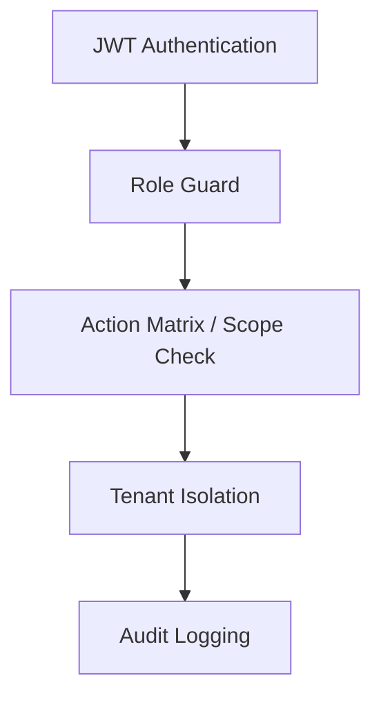

# Falcon Campus OS — Security Guide

Security architecture for the SGVU Campus OS pilot, covering RBAC, tenant isolation, Dean scope enforcement, IDOR mitigations, and audit logging.

---

## Security model overview

Falcon uses **defense in depth**:



Every request passes through JWT validation. Role guards gate controller access. Service-layer checks enforce department/school scope and fine-grained actions. All data is tenant-scoped.

---

## RBAC

### Portal-level access

Defined in `frontend/src/lib/auth-routing.ts` (`portalRoles`) and enforced on both frontend (`canRoleAccessPath`) and backend (`@Roles()`).

Pilot-critical mappings:

| Portal | Allowed roles |
|--------|---------------|
| `/faculty` | Faculty |
| `/hod` | HOD |
| `/dean` | Dean |
| `/exam-cell` | ExamCell, DeputyCOE, ExamAdmin, ExamOperator, SuperAdmin |

### Controller-level roles

NestJS controllers use:

```typescript
@UseGuards(JwtAuthGuard, RolesGuard)
@Roles('HOD', 'SuperAdmin')
```

The guard checks `user.role` and `user.roles[]` (case-insensitive).

### Exam Cell action matrix

File: `backend/src/modules/exam-cell/exam-cell-rbac.util.ts`

Sensitive controller methods call `assertExamCellAction(examCellRoleFromUser(user), action)` **before** executing business logic.

| Action | ExamCell | DeputyCOE | ExamAdmin | ExamOperator |
|--------|----------|-----------|-----------|--------------|
| `view_dashboard` | ✓ | ✓ | ✓ | ✓ |
| `manage_sessions` | ✓ | ✓ | ✓ | — |
| `manage_schedules` | ✓ | ✓ | ✓ | — |
| `generate_admit_cards` | ✓ | ✓ | ✓ | ✓ |
| `manage_seating` | ✓ | ✓ | ✓ | ✓ |
| `publish_results` | ✓ | ✓ | — | — |
| `approve_ufm` | ✓ | ✓ | — | — |
| `manage_qp` | ✓ | — | — | — |

Frontend mirror: `frontend/src/lib/exam-cell-rbac.ts` (keep in sync).

**Verification:** `cd tests && npm run test:unit -- exam-cell-rbac`

### HR module permissions

Faculty/HOD/Dean accessing `/hr` require `hr_capabilities` or explicit `permissions[]` unless they are HR, HRAdmin, or SuperAdmin. Admin routes under `/hr/admin` require HRAdmin or SuperAdmin.

### SuperAdmin impersonation

Global `ImpersonationReadOnlyGuard` blocks **all write operations** during impersonation sessions to prevent accidental or malicious data mutation.

---

## Tenant isolation

### Mechanism

| Component | File | Behavior |
|-----------|------|----------|
| `TenantContextInterceptor` | `tenant/interceptors/tenant-context.interceptor.ts` | Sets `tenant_id` on request from subdomain |
| `TenantSchemaInterceptor` | `tenant/interceptors/tenant-schema.interceptor.ts` | Schema routing for multi-tenant SaaS |
| Entity scope subscriber | `common/entity-scope/entity-scope.subscriber.ts` | Auto-injects tenant on insert |

Every query in services should filter by `tenant_id` from `req.user.tenant_id`. Cross-tenant access returns empty results or 404 — never another tenant's data.

### HR multi-entity

HR tenants with multiple legal entities use:

- Header: `x-entity-id`
- Guard: `EntityScopeGuard`
- Interceptor: `HrEntityScopeInterceptor`

---

## Dean scope enforcement

### Resolution

`backend/src/modules/academics/dean-scope.util.ts`:

```typescript
resolveDeanScope(db, deanUserId) → { schoolIds, departmentIds, schools }
```

Department IDs come from:

1. Programs under Dean's schools (`iam_programs.school_id`)
2. Departments under those schools
3. Departments where user is HOD (`departments.hod_user_id`)
4. User's own `dept_id` (if set)

### Enforcement points

| Service | Check |
|---------|-------|
| `dean-intelligence.service.ts` | All list/query endpoints filter by `departmentIds` |
| `academics.service.ts` | Dean funding, student monitor, grievances |
| `ticket.service.ts` | `ForbiddenException('Ticket is outside your school scope')` |
| `attendance-policy.service.ts` | Threshold requests scoped to school |
| `phd-lifecycle.service.ts` | Ph.D. candidates outside school rejected |

### Utility

```typescript
isDepartmentInDeanScope(deptId, departmentIds) → boolean
```

Use before returning or mutating any department-scoped resource for Dean role.

**Verification:** `cd tests && npm run test:unit -- dean-scope`

---

## HOD scope enforcement

HOD endpoints resolve department via:

- `departments.hod_user_id = current user`
- User's assigned `dept_id`

HOD cannot access another department's:

- Funding requests
- Student monitor data
- Course allocation
- Compiled results

SuperAdmin bypasses scope for support operations.

---

## IDOR fixes (Insecure Direct Object Reference)

Recent hardening addressed predictable UUID access across workspaces:

| Area | Mitigation |
|------|------------|
| Dean inbox / result approvals | Request must belong to Dean's school departments |
| HOD funding approvals | `request.dept_id` must match HOD department |
| Exam hall ticket approvals | Tenant + session scope validation |
| Grade card PDF export | Grade card must belong to tenant; role check on export |
| Student monitor detail | HOD/Dean scope on `student.dept_id` |
| Helpdesk tickets | Category routing + scope check on read |

**Pattern:** Never trust client-supplied IDs alone. Always re-fetch with `(tenant_id, scope_ids, resource_id)` in SQL WHERE clause.

### Example secure query pattern

```sql
SELECT * FROM project_funding_requests
WHERE request_id = $1
  AND tenant_id = $2
  AND dept_id = ANY($3::int[])  -- HOD or Dean scope
```

---

## Dean result approval security

Tables: `exam_result_dean_approval_requests`, `exam_result_dean_approval_history`

| Control | Implementation |
|---------|----------------|
| Single pending request per session | Unique partial index on `session_id WHERE status = 'PENDING'` |
| Dean-only decision | `@Roles('Dean', 'SuperAdmin')` on decision endpoint |
| Reject requires comment | Server-side validation on `decision = REJECTED` |
| COE cannot self-approve | `dean-approval` creates PENDING row; declare blocked until APPROVED |
| History immutability | Append-only history table |

Migration: `20260717100000_exam_result_dean_approval_requests.sql`

---

## Audit logging

### System audit (automatic)

`SystemAuditSubscriber` (`core/audit/system-audit.subscriber.ts`) captures INSERT/UPDATE/DELETE on entities into `system_audit_logs`:

- `table_name`, `record_id`, `action`
- `old_value`, `new_value` (JSONB)
- `changed_by_user_id`

Skipped tables: `system_audit_logs`, `leadership_feed_events`

### Domain audit (Exam Cell)

`ExamCellAuditService` records high-risk actions:

- Result session state transitions
- Dean approval submissions
- Declare / publish events
- UFM case decisions

Exposed at `GET /api/exam-cell/audit-log` (paginated).

### Dean audit

`GET /api/academics/dean/intelligence/audit-log` — school-scoped activity feed.

---

## Input validation & output sanitization

| Layer | Implementation |
|-------|----------------|
| Request bodies | `class-validator` DTOs + global `ValidationPipe` (`whitelist`, `forbidNonWhitelisted`) |
| Query params | Parsed via `parseListQuery()` with numeric bounds on limit |
| SQL injection | Parameterized queries in services; TypeORM query builder |
| XSS (frontend) | React auto-escaping; no `dangerouslySetInnerHTML` in pilot portals |
| PII in logs | Avoid logging full JWT or passwords; audit stores JSONB diffs |

Module-specific sanitization exists (e.g. `listFinancePayoutsSanitized` in e-cell module) — not a global output filter.

---

## Rate limiting

**No global API rate limiter** is registered in `main.ts` (no `@nestjs/throttler`).

Module-specific limits exist where abuse risk is high:

| Module | Behavior |
|--------|----------|
| Venue booking | `assertRateLimit()` per student in `venue-booking.service.ts` |
| Scheduler | Delay between bulk notification sends |

Production deployments should add rate limiting at the **reverse proxy** (Nginx/Coolify) for `/auth/*` login endpoints.

---

## Security headers

NestJS `main.ts` enables `compression()` and CORS but does **not** register Helmet. Recommended production headers at reverse proxy:

- `Strict-Transport-Security`
- `X-Content-Type-Options: nosniff`
- `X-Frame-Options: DENY` (or CSP `frame-ancestors`)

---

## Secrets management

Store secrets in environment variables or platform secret stores (Coolify, VPS). Never commit `.env` files.

| Secret | Location |
|--------|----------|
| `JWT_SECRET` | Backend env |
| `DB_PASSWORD` | Backend env |
| `GOOGLE_CLIENT_SECRET` | Backend env |
| `S3_SECRET_KEY` | Backend env |
| `GEMINI_API_KEY` | Backend env |

Rotate immediately if exposed. Test suite uses `tests/.env.test` (gitignored) with non-production values from `.env.test.example`.

---

## Testing strategy (security)

| Test type | Location | Covers |
|-----------|----------|--------|
| RBAC unit | `tests/unit/rbac/`, `tests/unit/backend/exam-cell-rbac-extended.spec.ts` | Action matrix, guards |
| Dean scope | `tests/unit/dean/dean-scope.spec.ts` | School boundary |
| Tenant isolation | `tests/unit/security/tenant-isolation.spec.ts` | Subdomain resolution |
| Integration 403 | `tests/integration/rbac/`, `tests/integration/api/api-gateway-branches.integration.spec.ts` | HTTP contracts |
| E2E portal access | `tests/e2e/specs/rbac/portal-access.spec.ts` | Frontend RoleGate |
| Regression | `tests/unit/regression/rbac-regression.spec.ts` | Cross-portal denials |

Run: `cd tests && npm run test:ci`

---

## Known security assumptions

1. Reverse proxy terminates TLS and restricts CORS to production frontend origin.
2. PostgreSQL network access is private (not exposed to internet).
3. Redis is not publicly reachable.
4. SuperAdmin impersonation is trusted-operator only; read-only guard prevents accidental writes.
5. Mock API gateway in tests is not deployed — production always uses NestJS guards.
6. `FeatureGuard` / tenant feature flags are not enforced until wired in modules (see [MISSING_DOCUMENTATION_REPORT.md](./MISSING_DOCUMENTATION_REPORT.md)).

---

## Production security checklist

Before Mechanical pilot go-live ([MECHANICAL_PILOT_LAUNCH_CHECKLIST.md](./MECHANICAL_PILOT_LAUNCH_CHECKLIST.md)):

- [ ] `JWT_SECRET` rotated from example value
- [ ] `DB_SYNCHRONIZE=false`
- [ ] Dev login endpoints unreachable in production
- [ ] Exam Operator receives **403** on publish/UFM (automated + manual)
- [ ] HOD sees only Mech Engg data
- [ ] Dean sees only school-scoped departments
- [ ] Dean result approval migration applied
- [ ] Audit log records declare/publish with actor + timestamp
- [ ] HTTPS terminated at reverse proxy
- [ ] CORS restricted to production frontend origin

---

## Reporting security issues

1. Do not commit secrets to the repository.
2. Rotate credentials if `.env` was exposed.
3. Document scope of affected endpoints in CHANGELOG after fix.

---

## Related docs

- [API_REFERENCE.md](./API_REFERENCE.md) — RBAC smoke test endpoints
- [TESTING_GUIDE.md](./TESTING_GUIDE.md) — automated RBAC tests
- [ARCHITECTURE.md](./ARCHITECTURE.md) — RBAC layers overview

---

*Security controls verified by `tests/unit/exam-cell-rbac.spec.ts`, `tests/unit/dean-scope.spec.ts`, and pilot launch checklist §3–§4.*
