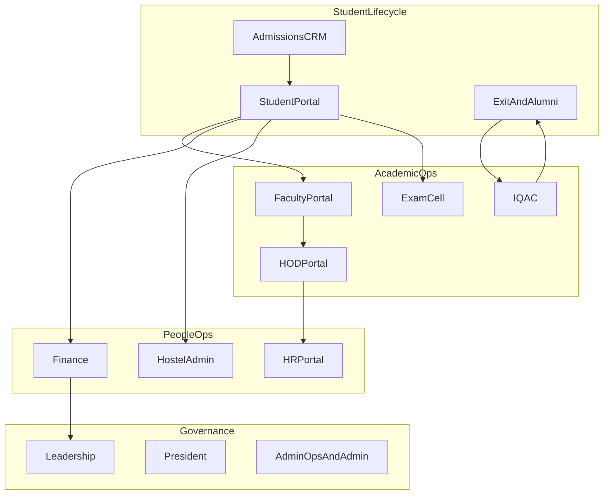
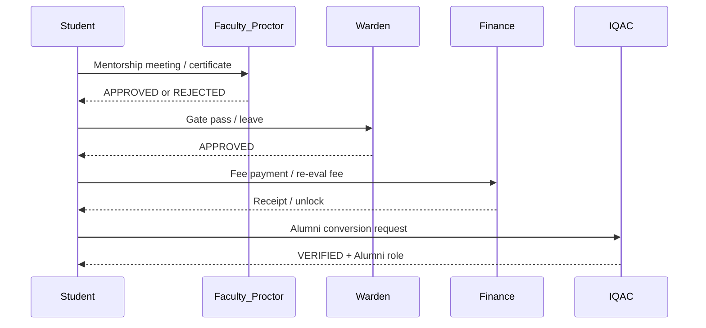
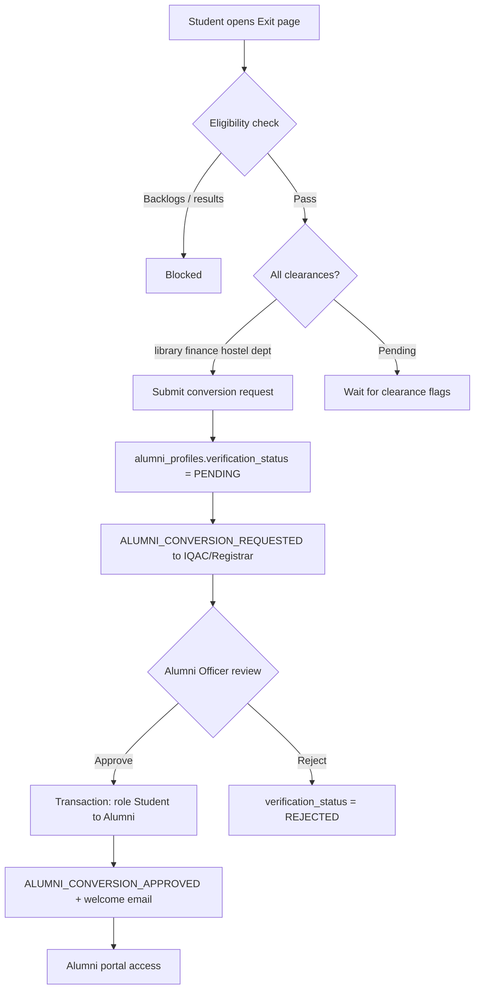
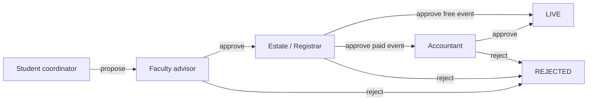
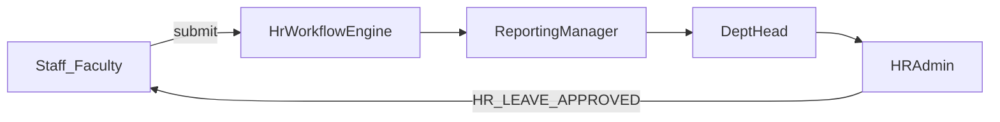
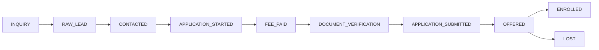
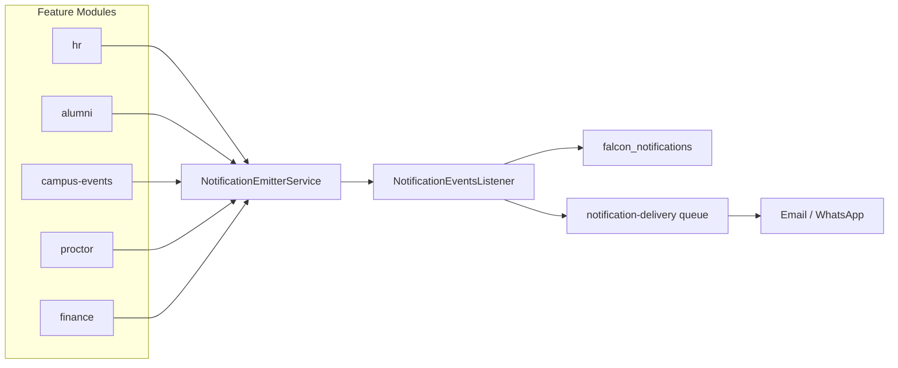
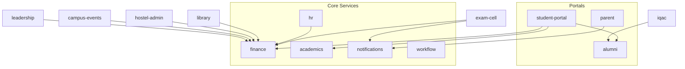

# Falcon Campus OS — Full System Map

> **Maintenance:** Update this document when adding roles (migrations), portal nav items ([`frontend/src/lib/navigation.ts`](../frontend/src/lib/navigation.ts)), notification events ([`backend/src/core/notifications/notification.events.ts`](../backend/src/core/notifications/notification.events.ts)), or new approval workflows.

This reference maps **every role → portal features**, **cross-role approval pipelines**, **async job queues**, and **notification connections** across Falcon.

**Source of truth in code:**

| Concern | Files |
|---------|-------|
| Role → dashboard & portal access | [`frontend/src/lib/auth-routing.ts`](../frontend/src/lib/auth-routing.ts) |
| Sidebar navigation per portal | [`frontend/src/lib/navigation.ts`](../frontend/src/lib/navigation.ts) |
| Workflow routing | [`backend/src/core/workflow/workflow-routing.service.ts`](../backend/src/core/workflow/workflow-routing.service.ts) |
| Notification events | [`backend/src/core/notifications/notification.events.ts`](../backend/src/core/notifications/notification.events.ts) |
| Backend modules | [`backend/src/modules/`](../backend/src/modules/), [`backend/src/app.module.ts`](../backend/src/app.module.ts) |

---

## Table of Contents

1. [System Overview](#1-system-overview)
2. [Auth & Multi-Role Rules](#2-auth--multi-role-rules)
3. [Portal Access Matrix](#3-portal-access-matrix)
4. [Role Feature Maps](#4-role-feature-maps)
5. [Cross-Role Workflows](#5-cross-role-workflows)
6. [Async Job Queues (BullMQ)](#6-async-job-queues-bullmq)
7. [Notification Event Bus](#7-notification-event-bus)
8. [Helpdesk Routing](#8-helpdesk-routing)
9. [Backend Module → Role Reference](#9-backend-module--role-reference)
10. [Known Gaps & Dual Systems](#10-known-gaps--dual-systems)

---

## 1. System Overview

Falcon is organized as **27 portal shells** under `frontend/src/app/(portals)/`, each gated by `RoleGate` + `canRoleAccessPath()`. Backend features live in **33 NestJS modules** shared across portals.



### Portal directory index

| # | Portal prefix | Primary roles |
|---|---------------|---------------|
| 1 | `/student` | Student, Applicant |
| 2 | `/faculty` | Faculty |
| 3 | `/hod` | HOD, Dean |
| 4 | `/hr` | HR, HRAdmin, SuperAdmin, Faculty, HOD, Dean, President, Accountant |
| 5 | `/ess` | Legacy self-service redirects → `/faculty\|hod\|hr/me/*` |
| 6 | `/hostel-admin` | Warden, SuperAdmin |
| 7 | `/finance` | Accountant, SuperAdmin |
| 8 | `/iqac` | IQAC, SuperAdmin, Registrar, President |
| 9 | `/library` | Librarian, SuperAdmin |
| 10 | `/parent` | Parent, SuperAdmin |
| 11 | `/exam-cell` | ExamCell, SuperAdmin |
| 12 | `/president` | President, SuperAdmin |
| 13 | `/leadership` | Chairman, President, SuperAdmin, Registrar |
| 14 | `/alumni` | Alumni |
| 15 | `/alumni-admin` | IQAC, SuperAdmin, Registrar, President |
| 16 | `/admin-ops` | Registrar, SuperAdmin, TransportOfficer |
| 17 | `/placements` | PlacementCell, SuperAdmin, Registrar |
| 18 | `/admin` | SuperAdmin, Registrar |
| 19 | `/super-admin` | SuperAdmin |
| 20 | `/admissions-crm` | SuperAdmin, AdmissionsOfficer, Registrar |
| 21 | `/directory` | Chairman, President, SuperAdmin, Registrar, HRAdmin, HR, HOD, Dean, Warden, Faculty |
| 22 | `/documents` | Student, Faculty, Registrar, SuperAdmin, Parent |
| 23 | `/reports` | Registrar, SuperAdmin, President, Accountant |
| 24 | `/research` | IQAC, Faculty, HOD, Dean, Chairman, SuperAdmin |
| 25 | `/clinic-admin` | Registrar, SuperAdmin |
| 26 | `/tickets/view/[id]` | Deep link (role-based redirect) |
| 27 | `/iqac-admin`, `/dashboard` | Standalone IQAC admin links |

---

## 2. Auth & Multi-Role Rules

- Users have a primary `role_id` plus optional multi-role rows in `user_roles`. JWT returns `role`, `roles[]`, `primaryRole`, `hr_capabilities`, `permissions[]`.
- **Workspace switcher** appears when `user.roles.length > 1`; switches via `getDashboardPathForRole()`.
- **HR portal** is module-gated: Faculty/HOD/Dean/Accountant/President need `hr_capabilities` or `permissions` unless they are HR, HRAdmin, or SuperAdmin.
- **Admin console** nav items have per-item `roles` arrays — Registrar sees fewer modules than SuperAdmin.
- **HR Admin items** (Access Control, Rules Engine, Workflows) require `HRAdmin` or `SuperAdmin`.
- **Entity creator** (`/super-admin/entities`) restricted to SuperAdmin + email `superadmin@mygyanvihar.com`.
- **ESS legacy** (`/ess/*`) redirects into workspace-specific self-service at `/faculty/me/*`, `/hod/me/*`, `/hr/me/*`.

### Shared self-service nav (Faculty, HOD, HR)

All three workspaces include **My HR & Operations**:

- My Profile & Documents
- Attendance & Holidays Calendar (`/hr/me/attendance-holidays`)
- My Payslips & Tax
- Company Policies
- My Helpdesk Tickets

---

## 3. Portal Access Matrix

From `portalRoles` in [`auth-routing.ts`](../frontend/src/lib/auth-routing.ts):

| Portal | Allowed roles |
|--------|---------------|
| `/student` | Student, Applicant |
| `/faculty` | Faculty |
| `/hod` | HOD, Dean |
| `/hr` | HR, HRAdmin, SuperAdmin, Faculty, HOD, Dean, President, Accountant (+ module permissions) |
| `/ess` | Faculty, HOD, Dean, HR, SuperAdmin |
| `/hostel-admin` | Warden, SuperAdmin |
| `/finance` | Accountant, SuperAdmin |
| `/iqac` | IQAC, SuperAdmin, Registrar, President |
| `/library` | Librarian, SuperAdmin |
| `/president` | President, SuperAdmin |
| `/leadership` | Chairman, President, SuperAdmin, Registrar |
| `/parent` | Parent, SuperAdmin |
| `/exam-cell` | ExamCell, SuperAdmin |
| `/alumni` | Alumni |
| `/alumni-admin` | IQAC, SuperAdmin, Registrar, President |
| `/admin-ops` | Registrar, SuperAdmin, TransportOfficer |
| `/placements` | PlacementCell, SuperAdmin, Registrar |
| `/documents` | Student, Faculty, Registrar, SuperAdmin, Parent |
| `/reports` | Registrar, SuperAdmin, President, Accountant |
| `/admin` | SuperAdmin, Registrar |
| `/super-admin` | SuperAdmin |
| `/admissions-crm` | SuperAdmin, AdmissionsOfficer, Registrar |
| `/clinic-admin` | Registrar, SuperAdmin |
| `/research` | IQAC, Faculty, HOD, Dean, Chairman, SuperAdmin |

---

## 4. Role Feature Maps

Each section lists: **home path**, **primary portal features**, **additional portal access**, **backend modules**.

---

### Student / Applicant

| Field | Value |
|-------|-------|
| **Home** | `/student/dashboard` |
| **Portal** | `/student` |
| **Backend modules** | `student-portal`, `academics`, `exams`, `finance`, `placement`, `library`, `transport`, `campus-wallet`, `hostel-tatkal`, `operations/hostel`, `campus-events`, `helpdesk`, `alumni` (pre-conversion) |
| **Also accesses** | `/documents` |

**Features (sidebar):**

| Group | Features |
|-------|----------|
| Overview | Dashboard |
| Profile & Admission Hub | My Profile & Master Data, Admission & Document Vault, Exit & Alumni Transition |
| Academics & Examinations | Subjects & Registration (CBCS), Attendance & Progression, Marks & Grade Cards, Exam Desk |
| Campus Services | My Financial Ledger, Hostel & Mess, Smart Mess & Wallet, Hostel Bed Booking, Transport Hub, Library & Dues, Extra-Curriculars, Falcon Events |
| Support & Placements | Mentorship, Placements & Internships, Grievances & Helpdesk |
| Dynamic | Club Management (if club coordinator) |

---

### Parent

| Field | Value |
|-------|-------|
| **Home** | `/parent/dashboard` |
| **Portal** | `/parent` (OTP auth, read-only) |
| **Backend modules** | `parent`, `transport` (notifications) |
| **Also accesses** | `/documents` |

**Features:** Home, Academics, Finance, Tracking (+ routes: attendance, discipline, fees, marks)

---

### Alumni

| Field | Value |
|-------|-------|
| **Home** | `/alumni/dashboard` |
| **Portal** | `/alumni` |
| **Backend modules** | `alumni` |

**Features:** Dashboard, My Career Profile, Alumni Directory, Mentorship Program, Giving Back, Alumni Events, University Services

---

### Faculty

| Field | Value |
|-------|-------|
| **Home** | `/faculty/dashboard` |
| **Portal** | `/faculty` |
| **Backend modules** | `academics`, `proctor`, `lms-extended`, `hr` (ESS), `helpdesk`, `campus-events` |
| **Also accesses** | `/hr` (scoped), `/ess`, `/documents`, `/directory`, `/research` |

**Features:**

| Group | Features |
|-------|----------|
| Home | Dashboard |
| Academics & Teaching | Timetable & Extra Classes, Mark Attendance, Course Page & Syllabus, Digital Assignments, Examinations & Grading, CO-PO Mapping, Student Analytics, Digital Class Logbook |
| Students & Mentoring | Mentorship & Approvals, Project & Lab Guides |
| Research & Duties | Library OPAC, Exam Invigilation Duty, Research & Publications |
| Administration | Pending Approvals (Inbox), Falcon Core Tasks (IQAC), Event Approvals |
| My HR & Operations | Profile & Documents, Attendance & Holidays, Payslips & Tax, Company Policies, Helpdesk Tickets |

---

### HOD / Dean

| Field | Value |
|-------|-------|
| **Home** | `/hod/dashboard` |
| **Portal** | `/hod` (Dean uses same portal) |
| **Backend modules** | `academics`, `hr` (team inbox), `helpdesk` |
| **Also accesses** | `/hr` (scoped), `/ess`, `/directory`, `/research` |

**Features:**

| Group | Features |
|-------|----------|
| Department Health | Dashboard, Department Timetable |
| Academic Management | Course Allocation, Syllabus & Lesson Tracking, Result Analytics |
| Faculty & Staff | Faculty Roster & Workload, Pending Approvals (Inbox), Appraisals & API Scores |
| Student Affairs | Student Monitor, Defaulters & Slow Learners, Grievance Escalations |
| My HR & Operations | (same as Faculty) |

---

### HR / HRAdmin

| Field | Value |
|-------|-------|
| **Home** | `/hr/dashboard` |
| **Portal** | `/hr` |
| **Backend modules** | `hr` (full HRIS), BullMQ payroll/export |
| **Also accesses** | `/ess`, `/directory` (HRAdmin) |

**Features (HRAdmin/SuperAdmin see all; HR sees module-gated subset):**

| Group | Features |
|-------|----------|
| Home | Dashboard |
| Employee Master | Employee Directory, KYC & Document Vault |
| Time & Leaves | Attendance & Biometrics, Pending on Me, Leave Management & Balances |
| Payroll & Finance | Salary Structures, Payroll Processing |
| Performance & Lifecycle | Onboarding Pipeline, Offboarding & Exit, Recruitment (ATS), Appraisals & API Scores, Promotions & Workflows |
| Administration | Access Control Matrix, Attendance Rules Engine, Org Structure, Leave Policies, Approval Workflows, Checklist Templates, Company Policies, Analytics & Reports, Bulk Document Export |
| My HR & Operations | (self-service) |

**HRAdmin-only admin items:** Access Control, Rules Engine, Org Structure, Leave Policies, Approval Workflows, Checklist Templates.

---

### Warden

| Field | Value |
|-------|-------|
| **Home** | `/hostel-admin/dashboard` |
| **Portal** | `/hostel-admin` |
| **Backend modules** | `hostel-admin`, `hostel-tatkal`, `operations`, `campus-wallet` |

**Features:** Dashboard, Hostel Management, Student Management, Attendance (Roll Call), Leave & Gate Passes, Visitor Management, Tickets & Fines, Mess Management, Notifications, Mess Scanner, System & Master Data

---

### Accountant

| Field | Value |
|-------|-------|
| **Home** | `/finance/dashboard` |
| **Portal** | `/finance` |
| **Backend modules** | `finance`, `campus-events` (paid events), `reports` |
| **Also accesses** | `/hr` (scoped), `/reports`, `/documents`, `/admin` Finance module |

**Features:**

| Group | Features |
|-------|----------|
| Overview | Finance Dashboard |
| Receivables | Fee Structures & Demands, Collections & Receipts, Club Event Approvals, Scholarships & Waivers |
| Payables | Vendor Master, Expense Heads & Bills, Salary Processing |
| Core Accounting | Ledger Accounts, Budget Allocation, Audit Reports |

---

### Librarian

| Field | Value |
|-------|-------|
| **Home** | `/library/dashboard` |
| **Portal** | `/library` |
| **Backend modules** | `library` |

**Features:** Library Dashboard, Circulation Desk, Cataloging & Inventory, Defaulters & Fines, NAAC Reports, Gate Register

---

### ExamCell

| Field | Value |
|-------|-------|
| **Home** | `/exam-cell/dashboard` |
| **Portal** | `/exam-cell` |
| **Backend modules** | `exam-cell`, `exams`, `finance` (fees) |

**Features:**

| Group | Features |
|-------|----------|
| Pre-Exam | Command Center, Master Exam Schedule, Admit Card Engine, Seating Planner, Invigilation Roster |
| Post-Exam | Result Processing, Re-evaluations, UFM Malpractice Desk, Degree & Transcripts |

---

### IQAC

| Field | Value |
|-------|-------|
| **Home** | `/iqac/dashboard` |
| **Portal** | `/iqac`, `/alumni-admin` |
| **Backend modules** | `iqac`, `alumni-admin`, `research` |

**Features:**

| Group | Features |
|-------|----------|
| Analytics & KPI | Master KPI Dashboard, Ranking Analytics (NIRF) |
| Faculty & Academic Data | Faculty Contributions, Academic Audits & Feedback |
| Student Outcomes | Progression & Placements, Student Achievements |
| Alumni Relations | Alumni Verification, Donation Ledger, Alumni Events |
| Accreditation | NAAC Document Repository, Report Generator (AQAR & SSR), Falcon Core Tasks |

---

### PlacementCell

| Field | Value |
|-------|-------|
| **Home** | `/placements/dashboard` |
| **Portal** | `/placements` |
| **Backend modules** | `placement` |

**Features:** Dashboard, Company Master, Placement Drives & ATS, Skill & Training, Mock Interviews, Resume Builder

---

### Registrar

| Field | Value |
|-------|-------|
| **Home** | `/admin/dashboard` |
| **Primary hub** | `/admin` |
| **Backend modules** | `iam`, `admissions`, `academics`, `alumni-admin`, `iqac`, `admin-ops`, `clinic`, `search`, `reports` |
| **Also accesses** | `/iqac`, `/alumni-admin`, `/admin-ops`, `/placements`, `/admissions-crm`, `/clinic-admin`, `/leadership`, `/documents`, `/reports`, `/directory` |

**Admin console modules (role-filtered):** IAM & Hierarchy, Academics, University Directory (+ cross-portal access above)

---

### AdmissionsOfficer

| Field | Value |
|-------|-------|
| **Home** | `/admissions-crm/pipeline` |
| **Portal** | `/admissions-crm` |
| **Backend modules** | `admissions` (CRM + lead scoring queue) |

**Features:** Kanban pipeline, Counseling page

---

### TransportOfficer

| Field | Value |
|-------|-------|
| **Home** | `/admin-ops/fleet` |
| **Portal** | `/admin-ops` |
| **Backend modules** | `admin-ops`, `transport` |

**Features:** Fleet & Transport, Transport Hub (+ shared admin-ops items)

---

### President

| Field | Value |
|-------|-------|
| **Home** | `/president/executive-summary` |
| **Portals** | `/president`, `/leadership`, `/hr` (full), `/iqac`, `/alumni-admin`, `/reports`, `/directory` |
| **Backend modules** | `president`, `leadership`, `finance` (approvals), `hr` |

**Features:** Executive Summary, Academics, Finance, Compliance, HR Analytics

---

### Chairman

| Field | Value |
|-------|-------|
| **Home** | `/leadership/overview` |
| **Portals** | `/leadership`, `/research`, `/directory` |
| **Backend modules** | `leadership`, `leadership-ai`, `finance` (high-value OTP approvals) |

**Features:** Automated Insights, Versus · Comparative Analytics, Finance Config, Budget Allocation, Budget Monitor, Overview, Pillars 1–6 (Finance, Admissions Funnel, Academics, HR & Payroll, Infrastructure, Risk & Compliance), University Directory

---

### SuperAdmin

| Field | Value |
|-------|-------|
| **Home** | `/super-admin/dashboard` |
| **Portal** | `/super-admin` + virtually all portals in `portalRoles` |
| **Backend modules** | All modules + `super-admin`, `settings`, `iam` |

**Features:** Dashboard, Entities (entity-creator email only), Hierarchy, Impersonation, Override Logs

---

### Alumni Admin (IQAC / Registrar / President)

| Field | Value |
|-------|-------|
| **Home** | `/alumni-admin/verification` |
| **Portal** | `/alumni-admin` |
| **Backend modules** | `alumni-admin`, `alumni-conversion` |

**Features:** Pending Verifications, Donation Ledger, Engagement Analytics, Event Manager

---

### CompanyHR

| Field | Value |
|-------|-------|
| **Home** | `/dashboard` (fallback) |
| **Portal** | **None defined** — role exists in DB but has no frontend portal mapping |

---

## 5. Cross-Role Workflows

Each workflow: **initiator → approver chain → status flow → key files → notifications**.

---

### 5a. Student-facing pipelines

| Workflow | Initiator | Approver(s) | Status flow | Key files | Notifications |
|----------|-----------|-------------|-------------|-----------|---------------|
| **Exit → Alumni conversion** | Student | Library/Finance/Hostel/Dept clearances → IQAC/Registrar/Alumni Officer | `PENDING` → `VERIFIED` + Alumni role / `REJECTED` | `alumni-conversion.service.ts`, `alumni-admin.service.ts`, `student-portal.service.ts` | `ALUMNI_CONVERSION_REQUESTED`, `ALUMNI_CONVERSION_APPROVED` |
| **Hostel gate pass / room change** | Student | Warden | `PENDING` → `APPROVED` | `hostel-admin.service.ts`, `hostel.service.ts` | `WORKFLOW_APPROVAL_REQUIRED`, WebSocket `gate_pass.updated` |
| **Hostel leave** | Student | Warden | Created → `APPROVED` / `REJECTED` | `hostel-admin.service.ts` | — |
| **Tatkal bed booking** | Student | Payment system (no human) | `PENDING` → `CONFIRMED` / `EXPIRED` | `hostel-tatkal.service.ts` | — |
| **Mentorship meeting** | Student | Proctor (Faculty) | `PENDING` → `APPROVED` / `REJECTED` / `COMPLETED` | `proctor.service.ts` | `ACADEMICS_MEETING_REQUESTED`, `ACADEMICS_MEETING_RESPONDED` |
| **Proctor leave request** | Student | Proctor | `PENDING` → `APPROVED` / `REJECTED` | `proctor.service.ts` | Meeting event pattern |
| **Achievement certificates** | Student | Proctor | `PENDING` → `VERIFIED` / `REJECTED` | `certificates.service.ts`, `proctor.service.ts` | `WORKFLOW_APPROVAL_REQUIRED` |
| **Extracurricular (NCC/NSS)** | Student | Proctor → IQAC queue | `PENDING_VERIFICATION` | `student-portal.service.ts` | — |
| **Exam re-evaluation** | Student | Exam Cell (after fee) | `DRAFT`/`PENDING` + fee `PENDING` → `PAID` → processed | `exam-cell.service.ts`, `exams.service.ts` | `FINANCE_FEE_GENERATED` |
| **Placement application** | Student | PlacementCell advances | `APPLIED` → `APTITUDE_CLEARED` → `TECH_INTERVIEW` → `HR_INTERVIEW` → `OFFERED` / `REJECTED` | `placement.service.ts`, `placement.constants.ts` | `PLACEMENT_STAGE_UPDATED`, `PLACEMENT_JOB_POSTED` |
| **Campus club event** | Student coordinator | Faculty advisor → Estate → Finance (if paid) | See diagram below | `campus-events.service.ts` | `EVENT_PROPOSED`, `EVENT_PENDING_ESTATE`, `EVENT_PENDING_FINANCE` |
| **Helpdesk ticket** | Any | Auto-routed by category | `PENDING` → `IN_PROGRESS` → `RESOLVED` | `ticket.service.ts`, `workflow-routing.service.ts` | `HELPDESK_TICKET_REPLY` |



#### Alumni conversion pipeline (detailed)



**Prerequisites checked at approval** (`alumni-conversion.service.ts`):
- `student_exit_clearances`: `library_cleared`, `finance_cleared`, `hostel_cleared`, `dept_cleared` all true
- No active backlogs; final-semester results published
- Finance/library/hostel no-dues via eligibility check

**Frontend:** `/student/exit`, `/alumni-admin/verification`, `/iqac/alumni/verification`

#### Campus event 4-tier approval



**Status values:** `PENDING_ADVISOR` → `PENDING_ESTATE` → (`PENDING_FINANCE` if paid) → `LIVE` or `REJECTED` at any tier.

**Frontend:** `/student/events`, `/faculty/event-approvals`, `/admin-ops/events`, `/finance/events`

---

### 5b. Staff / HR pipelines

| Workflow | Initiator | Approver(s) | Status flow | Key files | Notifications |
|----------|-----------|-------------|-------------|-----------|---------------|
| **Leave / OD / regularization / comp-off** (modern) | Staff | Configurable chain | `PENDING` → multi-step → `HR_APPROVED` / `REJECTED` | `hr-workforce.service.ts`, `hr-workflow-routing.service.ts` | `WORKFLOW_APPROVAL_REQUIRED`, `HR_LEAVE_APPROVED` |
| **Leave** (legacy) | Staff | HOD → HR | `PENDING_HOD` → `PENDING_HR` → `APPROVED` / `REJECTED` | `hr.service.ts`, `leave-request.entity.ts` | `WORKFLOW_APPROVAL_REQUIRED` |
| **Staff gate pass** | Staff | HOD → HR | `PENDING` → `PENDING_HR` → `APPROVED` / `REJECTED` | `hr.service.ts`, `staff-gate-pass.entity.ts` | `WORKFLOW_APPROVAL_REQUIRED`, `OPERATIONS_GATE_PASS_UPDATED` |
| **Resignation / offboarding** | Employee (ESS) | HOD → HR | `PENDING_HOD` → `PENDING_HR` → `FNF_PENDING` → `FNF_COMPLETED` | `hr-ess.service.ts` | `WORKFLOW_APPROVAL_REQUIRED` |
| **Onboarding pipeline** | HR creates | Self-service steps | `DOCUMENTS` → `OFFER` → `POLICIES` → `ID_CARD` → `COMPLETED` | `hr-ess.service.ts` | `HR_ONBOARDING_CREDENTIALS` |
| **Recruitment ATS** | HR | — | `APPLIED` → `SHORTLISTED` → `INTERVIEW_SCHEDULED` → `OFFERED` → `HIRED` | `hr` recruitment module | — |
| **Extra class approval** | Faculty | HOD | `PENDING_HOD_APPROVAL` → `APPROVED` / `REJECTED` | `faculty-workspaces.service.ts` | — |
| **Marks publish** | Faculty | Exam Cell (COE) | `DRAFT` → `PENDING_COE` → `PUBLISHED` | `faculty-workspaces.service.ts`, `exam-cell.service.ts` | `EXAM_RESULTS_PUBLISHED`, `ACADEMICS_MARKS_PUBLISHED` |
| **Team inbox** | Staff requests | Manager / HR | LEAVE, DOCUMENT, APPRAISAL tabs | `hr-team.service.ts` | `WORKFLOW_APPROVAL_REQUIRED` |



**Dynamic HR workflow types** (configured at `/hr/admin/workflows`):
- LEAVE, ON_DUTY, REGULARIZATION, RESIGNATION, COMP_OFF, CTC_UPDATE

**Step resolver types:** REPORTING_MANAGER, DEPT_HEAD, HR_EXECUTIVE, HR_ADMIN, ROLE, SPECIFIC_USER

**Storage:** `hr_approval_workflows` / `hr_approval_workflow_steps`

**Frontend inboxes:** `/hr/inbox`, `/faculty/inbox`, `/hod/inbox`, `/faculty/team-requests`

**Attendance link:** `attendance-calculation.service.ts` treats pending regularization as `PENDING_REQUEST`; approved requests mark days regularized.

---

### 5c. Finance & governance pipelines

| Workflow | Initiator | Approver(s) | Threshold | Status flow | Key files |
|----------|-----------|-------------|-----------|-------------|-----------|
| **High-value PO / invoice** | Finance staff | Chairman / President / SuperAdmin | ≥ ₹1,00,000 | OTP verify → `APPROVED` | `finance-approvals.service.ts` |
| **PO creation** | Finance | Auto or board | ≥ ₹1,00,000 | `PENDING_BOARD_APPROVAL` / `APPROVED` | `finance-accounts.service.ts` |
| **Budget expansion** | Program head | Leadership reviewer | — | `PENDING` → `APPROVED` / `REJECTED` | `budget-fpa.service.ts`, `leadership.controller.ts` |
| **Fee demand generation** | Accountant | Async (Bull) | — | Job queued → demands created | `finance-bulk-demand.processor.ts` |
| **Scholarship / waiver** | Accountant | — | — | Finance portal action | `finance` module |

---

### 5d. Admissions pipeline

Kanban stages (not strict multi-approver workflow):

```
INQUIRY → RAW_LEAD → CONTACTED → APPLICATION_STARTED → FEE_PAID → DOCUMENT_VERIFICATION → APPLICATION_SUBMITTED → OFFERED → ENROLLED / LOST
```

**Document verification statuses:**
`UPLOADED` → `AI_VERIFIED` → `MANUAL_REVIEW_NEEDED` → `APPROVED` / `REJECTED`

**Lead scoring:** Bull queue `lead-scoring` via `LeadScoringProcessor`

**Key files:** `admissions.service.ts`, `admissions-crm.controller.ts`, `lead.entity.ts`, `document-verification.entity.ts`



**Frontend:** `/admissions-crm/pipeline`, `/admissions-crm/counseling`

---

### 5e. Alumni service requests (post-conversion)

| Field | Value |
|-------|-------|
| **Initiator** | Alumni |
| **Status flow** | `SUBMITTED` → `IN_PROGRESS` → `PAYMENT_PENDING` → `DISPATCHED` → `COMPLETED` / `REJECTED` |
| **Service types** | TRANSCRIPT, DEGREE_DISPATCH, MIGRATION_CERTIFICATE, BONAFIDE, OTHER |
| **Key files** | `alumni-portal.service.ts`, `alumni-service-request.entity.ts` |
| **Frontend** | `/alumni/services` |

---

### 5f. Parallel gate-pass systems

Two implementations both route to wardens:

| System | Table | Initiator | Approver | Status flow |
|--------|-------|-----------|----------|-------------|
| Hostel requests | `hostel_requests` | Student | Warden | `PENDING` → `APPROVED` |
| Operations gate passes | `operations_gate_passes` | Student | Warden | `PENDING` → `APPROVED` / `REJECTED` → `EXITED` / `RETURNED` |

**Key files:** `hostel-admin.service.ts`, `operations.service.ts`, `gate-pass.entity.ts`

---

## 6. Async Job Queues (BullMQ)

| Queue constant | Queue name | Trigger | Processor | Roles affected |
|----------------|------------|---------|-----------|----------------|
| `ALUMNI_CONVERSION_QUEUE` | `alumni-conversion` | Student submits alumni conversion | `AlumniConversionProcessor` | Student → Alumni |
| `NOTIFICATION_DELIVERY_QUEUE` | `notification-delivery` | Any notification event | `NotificationDeliveryProcessor` | All (email/WhatsApp) |
| `HR_PAYROLL_QUEUE` | `hr-payroll` | HR runs payroll batch | `HrPayrollProcessor` | HR, Accountant |
| `HR_DOCUMENT_EXPORT_QUEUE` | `hr-document-export` | HR bulk document export | `HrDocumentExportProcessor` | HR |
| `FINANCE_BULK_DEMAND_QUEUE` | `finance-bulk-demand` | Bulk fee demand generation | `FinanceBulkDemandProcessor` | Accountant, Student |
| `LEAD_SCORING_QUEUE` | `lead-scoring` | New/updated admission lead | `LeadScoringProcessor` | AdmissionsOfficer |
| `SUBMISSION_AI_QUEUE` | `submission-ai` | Assignment PDF upload | `AiSubmissionProcessor` | Faculty, Student |
| `LEADERSHIP_ANOMALY_QUEUE` | `leadership-anomaly` | Spending anomaly detection | `AnomalyDetectionProcessor` | Chairman, Finance (can escalate PO to `PENDING_BOARD_APPROVAL`) |

**Constants files:** `backend/src/common/constants/*-queue.constants.ts`

---

## 7. Notification Event Bus

**Flow:** Feature service → `NotificationEmitterService` → `NotificationEventsListener` → in-app (`falcon_notifications`) + Bull `notification-delivery` (email/WhatsApp)

**Special listener:** `AlumniWelcomeEmailListener` handles `ALUMNI_WELCOME_EMAIL` / `ALUMNI_CONVERSION_APPROVED` via nodemailer directly.

### Event catalog

| Event | Category | From → To | Trigger |
|-------|----------|-----------|---------|
| `finance.fee_generated` | FINANCE | System → Student | Fee demand created |
| `finance.admit_card_locked` | FINANCE | System → Student | Unpaid fees block admit card |
| `exam.results_published` | ACADEMICS | Exam Cell → Student | COE publishes results |
| `academics.attendance_warning` | ACADEMICS | System → Student | Low attendance threshold |
| `academics.timetable_changed` | ACADEMICS | System → Student | Timetable update |
| `academics.marks_published` | ACADEMICS | Faculty → Student | Marks published |
| `academics.course_material_added` | ACADEMICS | Faculty → Student | New course material |
| `academics.meeting_requested` | ACADEMICS | Student → Proctor | Mentorship meeting request |
| `academics.meeting_responded` | ACADEMICS | Proctor → Student | Meeting approved/rejected |
| `operations.gate_pass_updated` | HOSTEL | Warden → Student | Gate pass decision |
| `hr.leave_approved` | HR | HR → Staff | Final leave approval |
| `hr.penalty_applied` | HR | System → Staff | Attendance penalty |
| `hr.onboarding_credentials` | HR | HR → New hire | Onboarding credentials issued |
| `hr.export_ready` | HR | System → HR admin | Document export complete |
| `hr.export_failed` | HR | System → HR admin | Document export failed |
| `placement.job_posted` | PLACEMENT | PlacementCell → Students | New job posted |
| `placement.stage_updated` | PLACEMENT | PlacementCell → Student | Application stage change |
| `helpdesk.ticket_reply` | HELPDESK | Assignee → Requester | Ticket reply |
| `operations.library_overdue` | OPERATIONS | System → Student | Library overdue |
| `operations.library_reservation_ready` | OPERATIONS | System → Student | Reserved book ready |
| `operations.transport_bus_approaching` | OPERATIONS | System → Student/Parent | Bus ETA alert |
| `workflow.approval_required` | WORKFLOW | Requester → Approver | Any pending approval |
| `event.proposed` | OPERATIONS | Club → Faculty advisor | Event proposed |
| `event.pending_estate` | OPERATIONS | System → Admin-ops | Estate approval needed |
| `event.pending_finance` | FINANCE | System → Accountant | Finance approval needed |
| `alumni.conversion_requested` | OPERATIONS | Student → IQAC/Registrar | Alumni conversion submit |
| `alumni.conversion_approved` | OPERATIONS | Officer → Student | Conversion approved (email) |
| `alumni.welcome_email` | OPERATIONS | System → Alumni | Welcome email |



**In-app API:** `/api/notifications` — any authenticated user (JWT only).

---

## 8. Helpdesk Routing

From `WorkflowRoutingService.getHelpdeskAssignee()`:

| Category | Routed to | Fallback |
|----------|-----------|----------|
| `FINANCE` | Finance admin | — |
| `IT` | IT admin | SuperAdmin |
| `HOSTEL` | Warden (by student's hostel block) | — |
| `MENTORSHIP` | Student's proctor | — |
| `ACADEMICS` | Student's proctor | HOD (fallback email) |
| `STUDENT_PROFILE` | Registrar | HOD (fallback email) |

**Key files:** `workflow-routing.service.ts`, `ticket.service.ts`

**Frontend:** `/student/helpdesk`, `/faculty/me/tickets`, `/hod/me/tickets`, `/hr/me/tickets`

---

## 9. Backend Module → Role Reference

### Module map (33 modules)

| Module | Route prefix | Primary roles | Main workflows |
|--------|--------------|---------------|------------------|
| **iam** | `/iam` | SuperAdmin (write), all (read) | Campus/school/program CRUD |
| **admissions** | `/admissions`, `/api/admissions-crm` | AdmissionsOfficer, Registrar, SuperAdmin | Lead pipeline, counseling, merit lists |
| **student-portal** | `/api/student` | Student, Applicant | Dashboard, exit, alumni registration |
| **academics** | `/api/academics` | Faculty, HOD, Student, Registrar | Timetable, attendance, assignments, grading |
| **academics/proctor** | `/api/academics/proctor` | Student, Faculty | Mentorship, chat, certificates |
| **academics/certificates** | `/api/academics/certificates` | Student, Faculty, IQAC | Certificate request/verify |
| **exams** | `/api/academics/exams` | Student | Admit card, exam applications |
| **exam-cell** | `/api/exam-cell` | ExamCell, SuperAdmin | Schedules, seating, results, transcripts |
| **lms-extended** | `/api/lms` | Faculty, Student | Quizzes, live classes, forums |
| **finance** | `/finance`, `/api/finance` | Accountant, President, Chairman, Student (pay) | Fees, ledger, vendors, approvals |
| **hr** | `/hr`, `/api/hr` | HR, HRAdmin, Faculty/HOD/Dean (ESS) | Leaves, payroll, onboarding, exports |
| **placement** | `/api/placement` | PlacementCell, Student | Drives, applications, stages |
| **alumni** | `/api/alumni` | Alumni, Student | Profile, directory, conversion request |
| **alumni-admin** | `/api/alumni-admin` | IQAC, Registrar | Conversion queue, donations, events |
| **iqac** | `/iqac` | IQAC, President, Registrar | KPI, NIRF, NAAC, audits |
| **operations** | `/operations` | Warden, Librarian, TransportOfficer | Gate passes, library/transport CRUD |
| **operations/hostel** | `/api/operations/hostel` | Student | Allocation, requests, leaves |
| **hostel-admin** | `/api/hostel-admin` | Warden, SuperAdmin | Roll call, fines, mess, gate passes |
| **hostel-tatkal** | `/api/hostel-tatkal` | Student, Warden | Tatkal bed booking |
| **library** | `/api/library`, `/api/library-admin` | Student, Faculty, Librarian | Search, circulation, fines |
| **transport** | `/api/transport` | Student, TransportOfficer | Routes, GPS, passes |
| **campus-wallet** | `/api/campus-wallet`, `/api/mess` | Student, Warden | Wallet, mess ordering |
| **campus-events** | `/api/campus-events` | Student, Faculty, Registrar, Accountant | Event lifecycle, ticketing |
| **helpdesk** | `/api/helpdesk/tickets` | All (feature-gated) | Tickets, replies |
| **parent** | `/api/parent` | Parent (OTP) | Read-only child view |
| **leadership** | `/api/leadership` | Chairman, President | Intelligence, budget, anomalies |
| **leadership-ai** | `/api/leadership/ai` | Chairman, President | Gemini financial AI |
| **president** | `/api/president` | President | Executive roll-ups |
| **research** | `/api/research` | Faculty, IQAC, Chairman | Scholars, grants |
| **clinic** | `/api/clinic` | Registrar, SuperAdmin | Clinic visits |
| **admin-ops** | `/api/admin-ops` | Registrar, TransportOfficer | Assets, fleet, estate approvals |
| **integrations** | `/api/integrations` | Mixed | Moodle SSO, DigiLocker, WhatsApp |
| **search** | `/api/search` | Any authenticated | Global search, directory export |
| **reports** | `/api/reports` | Registrar, President, Accountant | Warehouse CSV exports |
| **settings** | `/settings` | SuperAdmin | Bulk user import |
| **super-admin** | `/api/super-admin` | SuperAdmin | Multi-entity, impersonation |

### Cross-module dependencies



**Notable imports:**
- `student-portal` → `AlumniModule`, `HelpdeskModule`
- `hr` → `FinanceModule` + BullMQ queues
- `exam-cell` → `FinanceModule`, `ExamsModule`
- `iqac` → `AlumniModule`
- `finance` → `CampusWalletModule`, `BudgetFpaModule`
- `library`, `transport`, `hostel-admin`, `campus-events` → `FinanceModule`

### Access control layers

| Layer | Where | Behavior |
|-------|-------|----------|
| JWT | Per-controller `@UseGuards(JwtAuthGuard)` | Required unless `@Public()` |
| Roles | `@Roles()` + `RolesGuard` | Must match `user.role` or `user.roles[]` |
| HR entity scope | `EntityScopeGuard` + `x-entity-id` | Multi-entity HR tenants |
| HR permissions | `HrPermissionGuard` + `@HrPermission()` | Module-level VIEW/EDIT |
| Owner access | `OwnerAccessGuard` | Leadership tier (`owner_access_control`) |
| Feature flag | `FeatureGuard` + `@RequiresFeature('helpdesk')` | Tenant subscription |
| Read-only portal | `ReadOnlyPortalGuard` | Parent portal |
| Impersonation | Global `ImpersonationReadOnlyGuard` | Blocks writes during impersonation |

---

## 10. Known Gaps & Dual Systems

Document these honestly — the map reflects current code, not idealized flows.

1. **Exit clearance flags** — `student_exit_clearances` (`library_cleared`, `finance_cleared`, `hostel_cleared`, `dept_cleared`) are read as prerequisites for alumni conversion approval, but no dedicated backend service was found that sets them to `true` (migration seed creates rows with `FALSE`).

2. **Two gate-pass systems** — `hostel_requests` (GATE_PASS type) and `operations_gate_passes` both route to wardens with overlapping purpose.

3. **Two HR leave systems** — legacy `hr_leave_requests` (`PENDING_HOD` → `PENDING_HR`) and modern `staff_leave_requests` with dynamic `hr_approval_workflows`.

4. **Hostel request rejection** — `hostel_requests.status` enum supports `REJECTED`, but `hostel-admin.service.ts` only implements `approveHostelRequest()` (no dedicated reject endpoint).

5. **CompanyHR role** — exists in database (`campus_os_gap_modules.sql`) but has no frontend portal mapping; falls back to `/dashboard`.

6. **Legacy role name variants** — migrations include alternate names (`HoD`, `Exam Cell`, `Accounts`); live app primarily uses PascalCase (`HOD`, `ExamCell`, `Accountant`). Routing compares case-insensitively for some variants.

---

## Quick reference: Status enums

| Domain | Entity | Status values |
|--------|--------|---------------|
| HR leave (legacy) | `LeaveRequest` | `DRAFT`, `PENDING_HOD`, `PENDING_DEAN`, `PENDING_HR`, `APPROVED`, `REJECTED`, `CANCELLED` |
| HR leave (modern) | `StaffLeaveRequest` | `PENDING`, `HOD_APPROVED`, `HR_APPROVED`, `REJECTED` |
| Staff gate pass | `StaffGatePass` | `PENDING`, `PENDING_HR`, `APPROVED`, `REJECTED` |
| Hostel request | `HostelRequest` | `PENDING`, `APPROVED`, `REJECTED` |
| Operations gate pass | `GatePass` | `PENDING`, `APPROVED`, `REJECTED`, `EXITED`, `RETURNED`, `EXPIRED` |
| Mentorship | `MentorshipMeeting` | `PENDING`, `APPROVED`, `REJECTED`, `COMPLETED` |
| Alumni profile | `AlumniProfile` | `PENDING`, `VERIFIED`, `REJECTED` (+ legacy `APPROVED` in queries) |
| Campus events | `CampusEvent` | `PENDING_ADVISOR`, `PENDING_ESTATE`, `PENDING_FINANCE`, `LIVE`, `REJECTED` |
| Placement | `JobApplication` | `APPLIED`, `APTITUDE_CLEARED`, `TECH_INTERVIEW`, `HR_INTERVIEW`, `OFFERED`, `REJECTED` |
| Finance approvals | PO/invoice | `PENDING`, `APPROVED`, `PENDING_BOARD_APPROVAL` |
| Resignation | `ResignationRequest` | `PENDING_HOD`, `PENDING_HR`, `FNF_PENDING`, `FNF_COMPLETED`, `REJECTED`, `WITHDRAWN` |
| Admissions lead | `Lead` | `INQUIRY` … `ENROLLED`, `LOST` |
| Admissions docs | `DocumentVerification` | `UPLOADED`, `AI_VERIFIED`, `MANUAL_REVIEW_NEEDED`, `APPROVED`, `REJECTED` |
| Alumni services | `AlumniServiceRequest` | `SUBMITTED`, `IN_PROGRESS`, `PAYMENT_PENDING`, `DISPATCHED`, `COMPLETED`, `REJECTED` |
| Helpdesk | `HelpdeskTicket` | `PENDING`, `IN_PROGRESS`, `RESOLVED` |

---

*Generated from Falcon codebase. Last aligned with navigation and workflow services in the repository root.*
