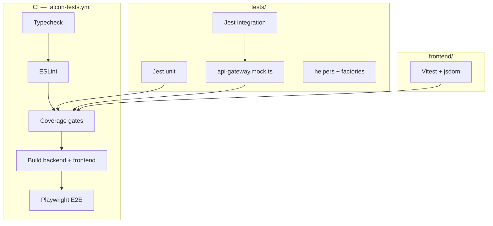

# Falcon Campus OS — Testing Guide

Complete testing documentation for Phase A (infrastructure), Phase B (workflow suite), and Phase B.1 (coverage & CI gates).

> **Related:** [PHASE_B_TEST_SUMMARY.md](./PHASE_B_TEST_SUMMARY.md) · [PHASE_B1_COVERAGE_REPORT.md](./PHASE_B1_COVERAGE_REPORT.md) · [DEVELOPER_GUIDE.md](./DEVELOPER_GUIDE.md)

---

## Overview

| Layer | Tooling | Location | Count (approx.) |
|-------|---------|----------|-----------------|
| Backend unit | Jest + ts-jest | `tests/unit/` | 107 tests |
| Backend integration | Jest + Supertest | `tests/integration/` | 48 active (+ 9 gated) |
| Frontend components | Vitest + RTL | `frontend/src/**/__tests__/` | 73 tests |
| E2E | Playwright (Chromium) | `tests/e2e/specs/` | 55 passed, 1 skipped |
| Backend module specs | NestJS Jest | `backend/src/**/*.spec.ts` | Separate from unified suite |

**Total unified suite:** 283 automated tests orchestrated from `tests/package.json`.

---

## Installation

```bash
# Repository root
cd Falcon/tests
cp .env.test.example .env.test    # adjust DB credentials if needed
npm install

cd ../frontend && npm install
cd ../backend && npm install

# Test database
createdb falcon_test               # once
npm run db:migrate:test            # from tests/

# Playwright browsers (required for E2E)
cd tests && npx playwright install chromium
```

### Enable optional live/DB suites

In `tests/.env.test`:

```env
FALCON_TEST_DB=1          # DB workflow integration tests
FALCON_RESET_DB=1         # Truncate public tables before integration run
FALCON_LIVE_API=1         # Hit running Nest server on FALCON_API_URL
FALCON_E2E_LIVE=1         # E2E against live stack (advanced)
```

---

## Running tests

From repository root:

```bash
npm test                  # delegates to tests/
```

From `tests/`:

| Command | Description |
|---------|-------------|
| `npm test` | Full suite: unit → integration → frontend → E2E |
| `npm run test:unit` | Jest unit (RBAC, workflows, guards, factories) |
| `npm run test:integration` | Jest + Supertest mock gateway |
| `npm run test:frontend` | Vitest in `frontend/` |
| `npm run test:frontend:cov` | Vitest with coverage thresholds |
| `npm run test:e2e` | Playwright |
| `npm run coverage` | Unit + integration coverage + backend module verify |
| `npm run test:ci` | Typecheck, lint, coverage, build, E2E (CI gate) |

Frontend only:

```bash
cd frontend && npm run test
cd frontend && npm run test:cov
```

Backend Nest specs (legacy module tests):

```bash
cd backend && npm test
```

---

## Testing architecture



### Mock vs live API

| Mode | When | How |
|------|------|-----|
| **Mock gateway** (default CI) | No Nest server required | `tests/mocks/api-gateway.mock.ts` — RBAC-aware Express app for Supertest |
| **Live API** (optional) | Local/staging with backend running | `FALCON_LIVE_API=1` — `integration/live/*.integration.spec.ts` |
| **Test DB** (CI + optional local) | Postgres `falcon_test` | `FALCON_TEST_DB=1` — `integration/db/*.integration.spec.ts` |

---

## Folder structure

```
tests/
├── jest.unit.config.cjs           # Unit coverage thresholds
├── jest.integration.config.cjs    # Integration coverage thresholds
├── jest.global-setup.cjs
├── jest.integration-global-setup.cjs
├── jest.setup.cjs
├── unit/
│   ├── backend/                   # jwt-auth-guard, pending-request, etc.
│   ├── rbac/                      # roles-guard, exam-cell-rbac, campus-admin
│   ├── dean/                      # dean-scope
│   ├── workflows/                 # cross-module state machines
│   ├── regression/                # pagination, RBAC regressions
│   └── security/                  # tenant-isolation
├── integration/
│   ├── auth/                      # login, logout, token invalidation
│   ├── rbac/                      # portal access contracts
│   ├── api/                       # search, filter, mock branch coverage
│   ├── workflows/                 # approval chains
│   ├── security/                  # multi-tenant
│   ├── error-handling/
│   ├── live/                      # gated live auth
│   └── db/                        # gated DB workflows
├── e2e/
│   ├── playwright.config.ts
│   ├── helpers/playwright-auth.ts
│   └── specs/                     # auth, faculty, hod, dean, exam-cell, rbac, workflows
├── helpers/
│   ├── env.ts, db.ts, seed-runner.ts
│   ├── auth.helper.ts, api-client.ts
│   ├── live-api.ts                # describeLiveApi / describeLiveDb
│   ├── rbac-matrix.ts, workflow-states.ts, workflow-routes.ts
│   └── test-users.ts
├── fixtures/                      # users.json, tenants.json
├── factories/                     # user.factory.ts, tenant.factory.ts
├── mocks/
│   ├── api-gateway.mock.ts        # Primary Supertest target
│   ├── external-services.ts       # Email, SMS, payment mocks
│   └── http-app.mock.ts
├── scripts/
│   ├── migrate-test-db.cjs
│   └── verify-backend-coverage.cjs
└── coverage/                      # Generated: unit/, integration/
```

---

## Coverage thresholds (enforced in CI)

### Unit — `jest.unit.config.cjs`

| Metric | Threshold |
|--------|------------:|
| Statements | ≥ 90% |
| Branches | ≥ 85% |
| Functions | ≥ 90% |
| Lines | ≥ 90% |

Scope: `tests/helpers/`, `tests/factories/`. Backend util/guard modules are validated via `scripts/verify-backend-coverage.cjs` (10 modules ↔ dedicated specs).

### Integration — `jest.integration.config.cjs`

| Metric | Threshold |
|--------|------------:|
| Statements | ≥ 90% |
| Branches | ≥ 80% |
| Functions | ≥ 85% |
| Lines | ≥ 90% |

Scope: `tests/mocks/api-gateway.mock.ts`

### Frontend — `frontend/vitest.config.ts`

| Metric | Threshold |
|--------|------------:|
| Statements | ≥ 85% |
| Branches | ≥ 80% |
| Functions | ≥ 85% |
| Lines | ≥ 85% |

Scoped to 13 pilot components/libs (RoleGate, PaginationBar, exam-cell RBAC, notifications, etc.).

Reports: `tests/coverage/unit/`, `tests/coverage/integration/`, `frontend/coverage/` (HTML + LCOV).

---

## Factories & fixtures

### Factories (`tests/factories/`)

```typescript
import { buildFacultyUser, buildHodUser, buildDeanUser } from '../factories/user.factory';
import { buildTenant } from '../factories/tenant.factory';
```

Build typed user/tenant objects for unit tests without hitting the database.

### Fixtures (`tests/fixtures/`)

- `users.json` — seeded persona emails aligned with `tests/.env.test.example`
- `tenants.json` — SGVU tenant metadata

### Test users (`tests/helpers/test-users.ts`)

Exports `TEST_USERS`, `TEST_PASSWORD` used by integration and E2E helpers.

---

## Seed runner

`tests/helpers/seed-runner.ts` delegates to `backend/scripts/run-migrations.js --seed` using test DB credentials from `.env.test`.

Used by DB workflow integration tests when `FALCON_TEST_DB=1`.

---

## Writing new tests

### Unit test (backend util)

1. Create `tests/unit/backend/my-util.spec.ts`
2. Import from `../../../backend/src/...`
3. Run `npm run test:unit -- my-util`
4. If targeting a new backend util in the verify script list, update `scripts/verify-backend-coverage.cjs`

### Integration test (API contract)

1. Create `tests/integration/api/my-feature.integration.spec.ts`
2. Use `createWorkflowApiMock()` from `tests/mocks/api-gateway.mock.ts` OR live API with `describeLiveApi`
3. Assert status codes, pagination shape `{ data, total, limit, offset }`, RBAC 403

Example:

```typescript
import request from 'supertest';
import { createWorkflowApiMock, resetWorkflowApiMock } from '../../mocks/api-gateway.mock';

describe('My API', () => {
  const app = createWorkflowApiMock();
  beforeEach(() => resetWorkflowApiMock());
  // ...
});
```

### Frontend component test

1. Add `src/components/my-domain/__tests__/MyComponent.test.tsx`
2. Use Vitest + `@testing-library/react`
3. If component should count toward coverage, add path to `frontend/vitest.config.ts` `coverage.include`

### Playwright E2E

1. Add spec under `tests/e2e/specs/<portal>/`
2. Use `tests/e2e/helpers/playwright-auth.ts` for mock session injection
3. Avoid duplicating smoke tests already in `workspace.spec.ts` files

Playwright config starts frontend via `webServer` (`npm run dev` locally, `npm run start` in CI after build).

---

## Regression test map

| QA fix area | Test location |
|-------------|---------------|
| RBAC portal access | `unit/regression/rbac-regression.spec.ts`, `e2e/specs/rbac/` |
| Tenant isolation | `unit/security/tenant-isolation.spec.ts`, `integration/security/` |
| IDOR / Dean scope | `unit/dean/dean-scope.spec.ts` |
| Pagination | `unit/regression/pagination-regression.spec.ts`, `integration/api/api-search-filter.integration.spec.ts` |
| Approval workflows | `integration/workflows/`, `e2e/specs/workflows/` |
| Exam Cell RBAC | `unit/rbac/exam-cell-rbac.spec.ts`, `unit/backend/exam-cell-rbac-extended.spec.ts` |
| Result workflow | Dean inbox + exam publish integration/E2E |

---

## CI pipeline

**Workflow:** `.github/workflows/falcon-tests.yml`

**Triggers:** push/PR to `main`, `develop`

**Steps:**

1. PostgreSQL 16 service (`falcon_test`)
2. Copy `tests/.env.test.example` → `.env.test`
3. `npm ci` in backend, frontend, tests
4. `npm run db:migrate:test`
5. `npx playwright install --with-deps chromium`
6. `npm run test:ci` from `tests/`
7. Upload artifacts: `coverage-unit`, `coverage-integration`, `coverage-frontend`, `playwright-report`

**Pre-deploy gate:**

```bash
cd tests && npm run test:ci
```

---

## Troubleshooting

| Issue | Fix |
|-------|-----|
| `falcon_test` does not exist | `createdb falcon_test` |
| Playwright executable missing | `npx playwright install chromium` |
| Integration DB tests skipped | Set `FALCON_TEST_DB=1`; run migrations |
| Live API tests skipped | Start backend; set `FALCON_LIVE_API=1` |
| Coverage threshold failure | See [PHASE_B1_COVERAGE_REPORT.md](./PHASE_B1_COVERAGE_REPORT.md) |
| E2E timeout on first run | Frontend `webServer` needs ~120s cold start |
| `@/` import errors in Vitest | Run via `frontend/vitest.config.ts`, not raw jest |

---

## Related documentation

| Doc | Topic |
|-----|-------|
| [PHASE_B_TEST_SUMMARY.md](./PHASE_B_TEST_SUMMARY.md) | Phase B deliverables |
| [PHASE_B1_COVERAGE_REPORT.md](./PHASE_B1_COVERAGE_REPORT.md) | Coverage gates & gaps |
| [DEVELOPER_GUIDE.md](./DEVELOPER_GUIDE.md) | Local setup |
| [SECURITY_GUIDE.md](./SECURITY_GUIDE.md) | RBAC verification |
| [tests/README.md](../tests/README.md) | Quick reference |

---

*Last updated: July 2026 — Phases A, B, and B.1 complete.*
